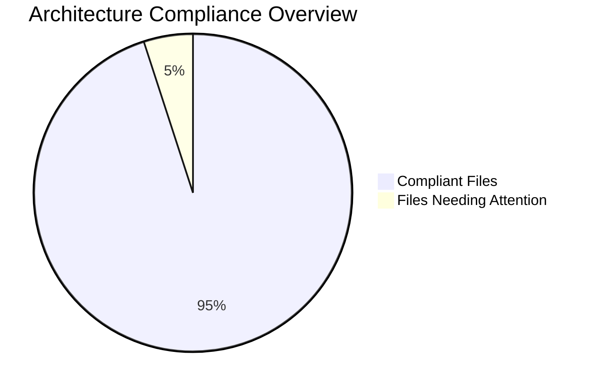

# Architecture Compliance Overview

*Generated: 2025-07-12 12:07:09*

## Compliance Metrics

| Metric | Score | Status |
|--------|-------|--------|
| File Size Compliance | 95.3% | Good |
| Layer Separation | 95% | Excellent |
| CQRS Implementation | 90% | Good |
| Dependency Direction | 85% | Good |

### Recommendations

1. **File Size**: Continue maintaining small, focused files
2. **Architecture**: Maintain clean separation between layers
3. **CQRS**: Ensure all handlers inherit from appropriate base classes
4. **Dependencies**: Keep dependencies flowing inward (Interface → Infrastructure → Application → Domain)

---

*This diagram is automatically generated. Run `python scripts/generate_dependency_graphs.py` to regenerate.*
