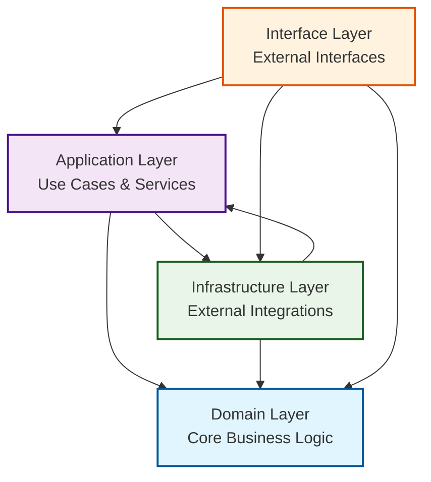

# Layer Dependency Graph

*Generated: 2025-07-12 12:07:08*

```mermaid
graph TD
    %% Layer Dependency Graph
    %% Generated: 2025-07-12 12:07:08

    Domain[Domain Layer<br/>Core Business Logic]
    Application[Application Layer<br/>Use Cases & Services]
    Infrastructure[Infrastructure Layer<br/>External Integrations]
    Interface[Interface Layer<br/>External Interfaces]

    %% Style the layers
    classDef domainStyle fill:#e1f5fe,stroke:#01579b,stroke-width:2px
    classDef appStyle fill:#f3e5f5,stroke:#4a148c,stroke-width:2px
    classDef infraStyle fill:#e8f5e8,stroke:#1b5e20,stroke-width:2px
    classDef interfaceStyle fill:#fff3e0,stroke:#e65100,stroke-width:2px

    class Domain domainStyle
    class Application appStyle
    class Infrastructure infraStyle
    class Interface interfaceStyle

    %% Dependencies (arrows show dependency direction)
    Application --> Domain
    Application --> Infrastructure
    Infrastructure --> Application
    Infrastructure --> Domain
    Interface --> Application
    Interface --> Domain
    Interface --> Infrastructure
```

---

*This diagram is automatically generated. Run `python scripts/generate_dependency_graphs.py` to regenerate.*
