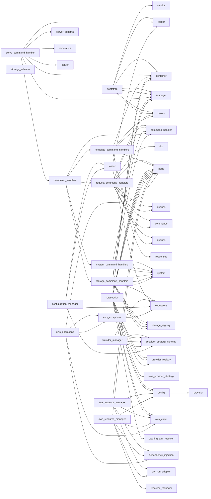

# Module Dependency Map

*Generated: 2025-07-12 12:07:09*

```mermaid
graph LR
    %% Module Dependency Map (Key Modules Only)
    %% Generated: 2025-07-12 12:07:09

    bootstrap[bootstrap]
    application_service[service]
    bootstrap --> application_service
    infrastructure_logging_logger[logger]
    bootstrap --> infrastructure_logging_logger
    infrastructure_di_container[container]
    bootstrap --> infrastructure_di_container
    config_manager[manager]
    bootstrap --> config_manager
    bootstrap --> config_manager
    infrastructure_di_buses[buses]
    bootstrap --> infrastructure_di_buses
    bootstrap --> infrastructure_di_buses
    interface_request_command_handlers[request_command_handlers]
    application_base_command_handler[command_handler]
    interface_request_command_handlers --> application_base_command_handler
    application_request_dto[dto]
    interface_request_command_handlers --> application_request_dto
    interface_request_command_handlers --> infrastructure_di_buses
    domain_base_ports[ports]
    interface_request_command_handlers --> domain_base_ports
    application_request_queries[queries]
    interface_request_command_handlers --> application_request_queries
    application_dto_commands[commands]
    interface_request_command_handlers --> application_dto_commands
    application_dto_queries[queries]
    interface_request_command_handlers --> application_dto_queries
    interface_request_command_handlers --> application_request_queries
    interface_request_command_handlers --> application_dto_commands
    interface_serve_command_handler[serve_command_handler]
    interface_command_handlers[command_handlers]
    interface_serve_command_handler --> interface_command_handlers
    interface_serve_command_handler --> config_manager
    config_schemas_server_schema[server_schema]
    interface_serve_command_handler --> config_schemas_server_schema
    interface_serve_command_handler --> infrastructure_di_container
    interface_serve_command_handler --> infrastructure_logging_logger
    infrastructure_error_decorators[decorators]
    interface_serve_command_handler --> infrastructure_error_decorators
    api_server[server]
    interface_serve_command_handler --> api_server
    interface_template_command_handlers[template_command_handlers]
    interface_template_command_handlers --> application_base_command_handler
    interface_template_command_handlers --> infrastructure_di_buses
    interface_template_command_handlers --> domain_base_ports
    application_dto_responses[responses]
    interface_template_command_handlers --> application_dto_responses
    interface_template_command_handlers --> application_dto_queries
    interface_template_command_handlers --> infrastructure_di_container
    interface_system_command_handlers[system_command_handlers]
    interface_system_command_handlers --> application_base_command_handler
    application_queries_system[system]
    interface_system_command_handlers --> application_queries_system
    interface_system_command_handlers --> application_queries_system
    interface_system_command_handlers --> application_queries_system
    interface_command_handlers --> application_base_command_handler
    interface_command_handlers --> interface_template_command_handlers
    interface_command_handlers --> interface_request_command_handlers
    interface_command_handlers --> interface_system_command_handlers
    interface_storage_command_handlers[storage_command_handlers]
    interface_command_handlers --> interface_storage_command_handlers
    interface_storage_command_handlers --> application_base_command_handler
    domain_base_exceptions[exceptions]
    interface_storage_command_handlers --> domain_base_exceptions
    interface_storage_command_handlers --> application_queries_system
    infrastructure_registry_storage_registry[storage_registry]
    interface_storage_command_handlers --> infrastructure_registry_storage_registry
    interface_storage_command_handlers --> config_manager
    interface_storage_command_handlers --> infrastructure_registry_storage_registry
    interface_storage_command_handlers --> config_manager
    interface_storage_command_handlers --> infrastructure_registry_storage_registry
    interface_storage_command_handlers --> application_queries_system
    interface_storage_command_handlers --> application_queries_system
    interface_storage_command_handlers --> infrastructure_registry_storage_registry
    config_loader[loader]
    config_loader --> domain_base_exceptions
    config_loader --> infrastructure_logging_logger
    config_managers_provider_manager[provider_manager]
    config_schemas_provider_strategy_schema[provider_strategy_schema]
    config_managers_provider_manager --> config_schemas_provider_strategy_schema
    config_managers_provider_manager --> domain_base_exceptions
    config_managers_provider_manager --> config_schemas_provider_strategy_schema
    config_managers_provider_manager --> config_schemas_provider_strategy_schema
    config_managers_provider_manager --> config_schemas_provider_strategy_schema
    config_managers_configuration_manager[configuration_manager]
    config_managers_configuration_manager --> domain_base_exceptions
    config_managers_configuration_manager --> config_loader
    config_managers_configuration_manager --> config_schemas_provider_strategy_schema
    config_managers_configuration_manager --> config_loader
    config_schemas_storage_schema[storage_schema]
    providers_aws_registration[registration]
    infrastructure_registry_provider_registry[provider_registry]
    providers_aws_registration --> infrastructure_registry_provider_registry
    providers_aws_registration --> domain_base_ports
    providers_aws_strategy_aws_provider_strategy[aws_provider_strategy]
    providers_aws_registration --> providers_aws_strategy_aws_provider_strategy
    providers_aws_configuration_config[config]
    providers_aws_registration --> providers_aws_configuration_config
    providers_aws_registration --> domain_base_ports
    providers_aws_registration --> domain_base_ports
    providers_aws_infrastructure_aws_client[aws_client]
    providers_aws_registration --> providers_aws_infrastructure_aws_client
    providers_aws_registration --> domain_base_ports
    providers_aws_registration --> providers_aws_configuration_config
    providers_aws_infrastructure_template_caching_ami_resolver[caching_ami_resolver]
    providers_aws_registration --> providers_aws_infrastructure_template_caching_ami_resolver
    providers_aws_registration --> infrastructure_registry_provider_registry
    providers_aws_registration --> infrastructure_di_container
    providers_aws_registration --> infrastructure_di_container
    providers_aws_registration --> infrastructure_registry_provider_registry
    providers_aws_registration --> providers_aws_infrastructure_aws_client
    providers_aws_registration --> domain_base_ports
    infrastructure_interfaces_provider[provider]
    providers_aws_configuration_config --> infrastructure_interfaces_provider
    providers_aws_managers_aws_instance_manager[aws_instance_manager]
    domain_base_dependency_injection[dependency_injection]
    providers_aws_managers_aws_instance_manager --> domain_base_dependency_injection
    providers_aws_managers_aws_instance_manager --> domain_base_ports
    providers_aws_managers_aws_instance_manager --> providers_aws_configuration_config
    providers_aws_managers_aws_instance_manager --> providers_aws_infrastructure_aws_client
    providers_aws_infrastructure_dry_run_adapter[dry_run_adapter]
    providers_aws_managers_aws_instance_manager --> providers_aws_infrastructure_dry_run_adapter
    providers_aws_managers_aws_resource_manager[aws_resource_manager]
    providers_aws_managers_aws_resource_manager --> domain_base_dependency_injection
    providers_aws_managers_aws_resource_manager --> domain_base_ports
    domain_base_resource_manager[resource_manager]
    providers_aws_managers_aws_resource_manager --> domain_base_resource_manager
    providers_aws_managers_aws_resource_manager --> providers_aws_configuration_config
    providers_aws_managers_aws_resource_manager --> providers_aws_infrastructure_aws_client
    providers_aws_managers_aws_resource_manager --> providers_aws_infrastructure_dry_run_adapter
    providers_aws_exceptions_aws_exceptions[aws_exceptions]
    providers_aws_exceptions_aws_exceptions --> domain_base_exceptions
    providers_aws_utilities_aws_operations[aws_operations]
    providers_aws_utilities_aws_operations --> providers_aws_exceptions_aws_exceptions
    providers_aws_utilities_aws_operations --> domain_base_dependency_injection
    providers_aws_utilities_aws_operations --> domain_base_ports
    providers_aws_utilities_aws_operations --> providers_aws_infrastructure_aws_client
    providers_aws_utilities_aws_operations --> providers_aws_exceptions_aws_exceptions
```

---

*This diagram is automatically generated. Run `python scripts/generate_dependency_graphs.py` to regenerate.*
