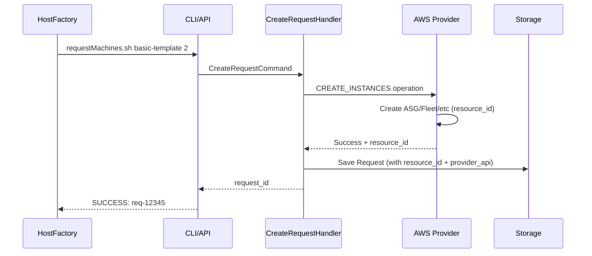
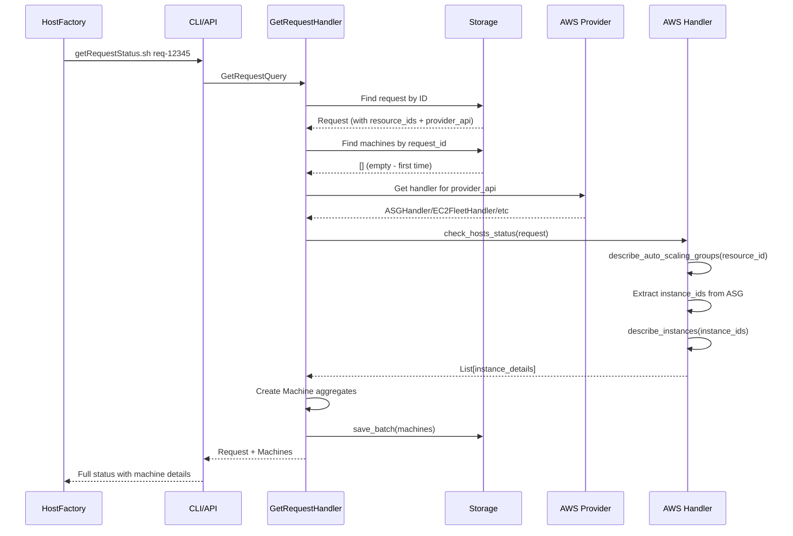

# Machine Discovery Flow Architecture

This document describes the complete end-to-end flow for machine discovery and status checking in the HostFactory plugin.

## Overview

The machine discovery flow consists of three main phases:
1. Request Creation - Create AWS resources and store request
2. Machine Discovery - Discover instances from AWS resources  
3. Status Reporting - Return comprehensive status with machine details

## Current Problem

The status check flow is broken because:
1. No machines are created after successful AWS resource provisioning
2. Query handler uses wrong operation type with incorrect parameters
3. Missing provider API information needed for handler selection

## Target Architecture

### Complete Request Flow



### Machine Discovery Flow



## Handler-Specific Discovery Methods

Each AWS handler implements resource-to-instance discovery:

### ASG Handler
- Uses `describe_auto_scaling_groups()` with ASG name
- Extracts instance IDs from ASG instances list
- Calls `describe_instances()` for detailed information

### EC2Fleet Handler  
- Uses `describe_fleets()` with Fleet ID
- For instant fleets: gets instance IDs from creation metadata
- For maintain/request fleets: uses `describe_fleet_instances()`
- Calls `describe_instances()` for detailed information

### SpotFleet Handler
- Uses `describe_spot_fleet_requests()` with Spot Fleet ID
- Uses `describe_spot_fleet_instances()` to get instance IDs
- Calls `describe_instances()` for detailed information

### RunInstances Handler
- Instance IDs available immediately from creation response
- Directly calls `describe_instances()` for status updates

## Data Storage Architecture

### Current Storage Structure
```
data/storage.json:
{
  "req-12345": {
    "request_id": "req-12345",
    "resource_ids": ["asg-hf-req-12345"],
    "machine_ids": [],  // Empty - this is the problem
    "status": "in_progress"
  }
}

machines.json: {} // Empty file
```

### Target Storage Structure
```
data/storage.json:
{
  "req-12345": {
    "request_id": "req-12345", 
    "resource_ids": ["asg-hf-req-12345"],
    "machine_ids": ["i-abc123", "i-def456"],
    "provider_api": "ASG",  // Added for handler selection
    "status": "completed"
  }
}

machines.json:
{
  "i-abc123": {
    "instance_id": "i-abc123",
    "request_id": "req-12345",
    "resource_id": "asg-hf-req-12345",
    "status": "running",
    "private_ip": "10.0.1.100"
  },
  "i-def456": {
    "instance_id": "i-def456", 
    "request_id": "req-12345",
    "resource_id": "asg-hf-req-12345",
    "status": "running",
    "private_ip": "10.0.1.101"
  }
}
```

## Implementation Requirements

### Fix 1: Store Provider API in Request
Store the provider API type during request creation to enable appropriate handler selection during status checks.

### Fix 2: Implement Machine Discovery
Replace the broken provider operation approach with direct handler method calls that already implement resource-to-instance discovery.

### Fix 3: Batch Machine Storage
Use the existing `save_batch()` method for efficient machine storage instead of individual saves.

## Error Scenarios

### No Machines Found
When no instances are discovered from AWS resources, return request status with empty machines list and appropriate status message.

### Handler Not Found
When provider API is not recognized, fall back to RunInstances handler or return error with clear message.

### AWS API Errors
Handle AWS API failures gracefully and return partial results when possible.
