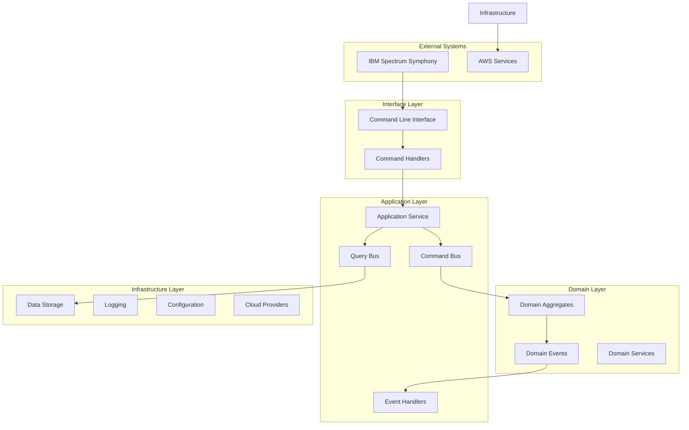
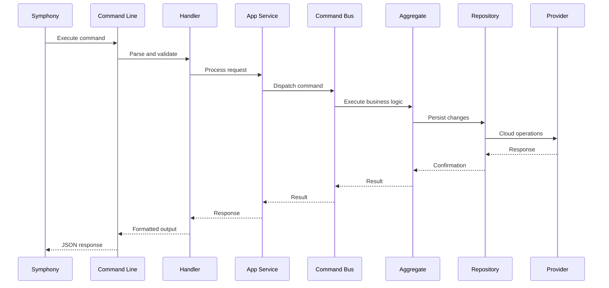
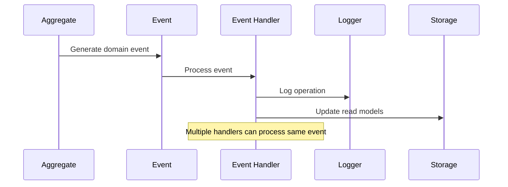
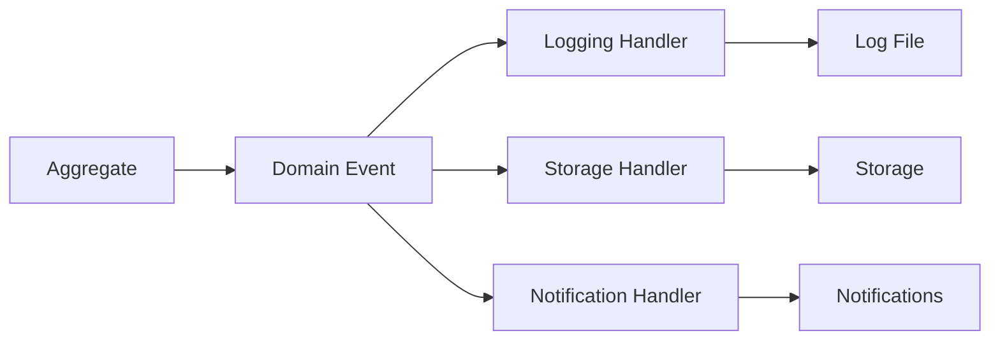
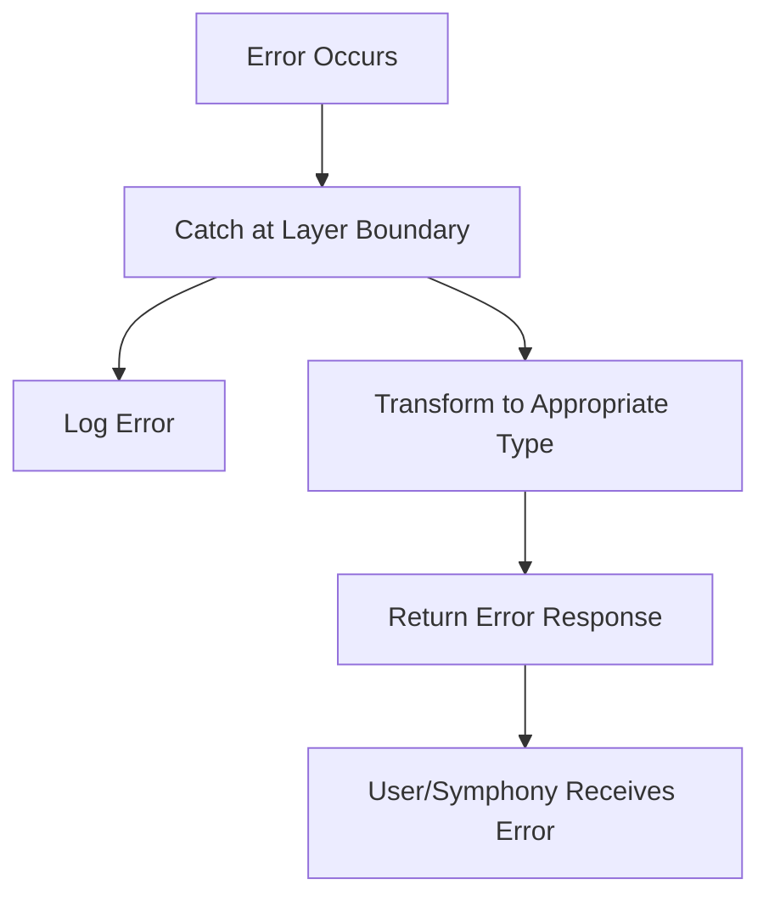

# Architecture - Developer Guide

This guide provides development-focused architectural guidance for working with the Open Host Factory Plugin. For high-level system overview, see the [Architecture Overview](../architecture/system_overview.md).

## Development Architecture Perspective

### Working with Clean Architecture Layers

When developing features, follow these layer interaction patterns:

```
CLI Interface -> Application Services -> Domain Logic
                        ^
Infrastructure <--------+
```

### Key Development Patterns

#### 1. Adding New Commands
```python
# 1. Create command in application layer
@dataclass
class NewFeatureCommand(BaseCommand):
    parameter: str

# 2. Create handler with domain dependencies
@command_handler(NewFeatureCommand)
class NewFeatureHandler:
    def __init__(self, domain_service: DomainService):
        self._domain_service = domain_service

    def handle(self, command: NewFeatureCommand):
        # Use domain services, not infrastructure directly
        return self._domain_service.execute_business_logic(command.parameter)
```

#### 2. Adding New Queries
```python
# Follow same pattern for read operations
@dataclass
class GetFeatureStatusQuery(BaseQuery):
    feature_id: str

@query_handler(GetFeatureStatusQuery)
class GetFeatureStatusHandler:
    def __init__(self, read_model: ReadModelPort):
        self._read_model = read_model
```

## System Overview



## Layer Architecture

### Interface Layer (`src/interface/`)

The interface layer handles command processing and application coordination:

**Components:**
- **Command Handlers**: Process application commands and coordinate with application services
- **Input Processing**: Handle command arguments, JSON data, and file input
- **Output Formatting**: Format responses for Symphony and CLI consumption

**Key Files:**
- `command_handlers.py` - Application command processing and coordination logic
- Command validation and response formatting

**Note**: This layer coordinates between the CLI entry point (run.py) and the application services, handling the translation of command-line inputs into application operations.

### Application Layer (`src/application/`)

The application layer orchestrates business operations:

**Components:**
- **Application Service**: Main orchestrator for operations
- **Command Bus**: Routes commands to appropriate handlers
- **Query Bus**: Routes queries to appropriate handlers
- **DTOs**: Data transfer objects for layer boundaries

**Architecture Pattern:**
- **CQRS for Complex Operations**: Request and machine management
- **Service Pattern for Simple Operations**: Template management
- **Event-Driven Processing**: Domain events trigger side effects

**Key Files:**
- `service.py` - Main application service
- `base/commands.py` - Command bus implementation
- `base/queries.py` - Query bus implementation
- `dto/` - Data transfer objects

### Domain Layer (`src/domain/`)

The domain layer contains pure business logic:

**Bounded Contexts:**

#### Template Context (`domain/template/`)
- **Template Aggregate**: VM template definitions
- **Template Repository**: Template storage interface
- **Template Events**: Template lifecycle events

#### Request Context (`domain/request/`)
- **Request Aggregate**: Machine provisioning requests
- **Request Repository**: Request storage interface
- **Request Events**: Request lifecycle events

#### Machine Context (`domain/machine/`)
- **Machine Aggregate**: Individual machine instances
- **Machine Repository**: Machine storage interface
- **Machine Events**: Machine lifecycle events

**Shared Kernel (`domain/base/`):**
- **Base Entities**: Common entity patterns
- **Value Objects**: Shared value types
- **Domain Events**: Event base classes
- **Exceptions**: Domain-specific exceptions

### Infrastructure Layer (`src/infrastructure/`)

The infrastructure layer provides technical services:

**Components:**
- **Persistence**: Data storage implementations
- **Logging**: Application logging
- **Configuration**: Configuration management
- **Events**: Event processing infrastructure
- **DI Container**: Dependency injection

**Key Files:**
- `logging/logger.py` - Logging configuration
- `config/` - Configuration management
- `events/` - Event infrastructure
- `di/container.py` - Dependency injection

### Provider Layer (`src/providers/`)

The provider layer implements cloud-specific functionality:

**AWS Provider (`providers/aws/`):**
- **Domain Extensions**: AWS-specific domain logic
- **Application Services**: AWS operation handlers
- **Infrastructure**: AWS API clients and utilities
- **Managers**: Resource-specific managers (EC2, ASG, etc.)

## Data Flow

### Command Processing Flow



### Event Processing Flow



## Storage Architecture

### JSON File Storage (Default)

```
data/
+--- request_database.json    # Single file containing all data
```

**Structure:**
```json
{
  "templates": {...},
  "requests": {...},
  "machines": {...}
}
```

### SQLite Storage (Optional)

```
data/
+--- request_database.db     # SQLite database file
```

**Tables:**
- `templates` - Template definitions
- `requests` - Request records
- `machines` - Machine instances
- `events` - Domain events (if event sourcing enabled)

## Configuration Architecture

### Configuration Hierarchy

1. **Environment Variables** (highest priority)
2. **Configuration File** (`config/config.json`)
3. **Default Values** (lowest priority)

### Configuration Structure

```json
{
  "provider": {
    "type": "aws",
    "aws": {...}
  },
  "logging": {...},
  "storage": {...},
  "template": {...},
  "events": {...}
}
```

## Event System Architecture

### Event Types

**Domain Events:**
- `RequestCreatedEvent` - New request created
- `RequestStatusChangedEvent` - Request status updated
- `MachineCreatedEvent` - Machine provisioned
- `MachineTerminatedEvent` - Machine terminated

**Event Handlers:**
- **Logging Handlers**: Log events for audit
- **Storage Handlers**: Update read models
- **Notification Handlers**: Send alerts (if configured)

### Event Flow



## Provider Architecture

### Provider Interface

```python
class ProviderInterface:
    def provision_machines(self, request: ProvisionRequest) -> List[Machine]
    def terminate_machines(self, machine_ids: List[str]) -> bool
    def get_machine_status(self, machine_ids: List[str]) -> List[MachineStatus]
```

### AWS Provider Implementation

**Components:**
- **EC2 Manager**: Direct instance management
- **ASG Manager**: Auto Scaling Group management
- **Fleet Manager**: EC2 Fleet management
- **Spot Manager**: Spot Fleet management

**AWS Services Used:**
- **EC2**: Instance provisioning and management
- **Auto Scaling**: Automatic scaling groups
- **CloudWatch**: Monitoring and metrics
- **IAM**: Identity and access management

## Error Handling Architecture

### Error Hierarchy

```
Exception
+--- DomainError
|   +--- ValidationError
|   +--- BusinessRuleError
|   +--- ResourceNotFoundError
+--- InfrastructureError
|   +--- StorageError
|   +--- ConfigurationError
|   +--- ProviderError
+--- ApplicationError
    +--- CommandError
    +--- QueryError
```

### Error Flow



## Testing Architecture

### Test Structure

```
tests/
+--- unit/           # Unit tests for individual components
+--- integration/    # Integration tests for layer interactions
+--- e2e/           # End-to-end tests for complete workflows
+--- fixtures/      # Test data and mocks
```

### Test Patterns

- **Unit Tests**: Test individual classes in isolation
- **Integration Tests**: Test layer interactions
- **End-to-End Tests**: Test complete command workflows
- **Mock Providers**: Test without actual cloud resources

## Deployment Architecture

### Single Instance Deployment

```
Server
+--- Application Files
+--- Configuration
+--- Data Storage
+--- Log Files
```

### Symphony Integration

```
Symphony Host Factory
+--- Provider Configuration
+--- Command Execution
+--- Response Processing
```

## Performance Considerations

### Optimization Strategies

- **Lazy Loading**: Load resources only when needed
- **Connection Pooling**: Reuse AWS connections
- **Caching**: Cache template and configuration data
- **Batch Operations**: Group similar operations

### Scalability Patterns

- **Stateless Design**: No shared state between commands
- **Event-Driven**: Asynchronous event processing
- **Provider Abstraction**: Easy to add new cloud providers
- **Configuration-Driven**: Behavior controlled by configuration

## Security Architecture

### Security Layers

1. **Authentication**: AWS credential management
2. **Authorization**: IAM permissions and policies
3. **Data Protection**: Secure configuration storage
4. **Audit Logging**: Complete operation audit trail

### Security Patterns

- **Principle of Least Privilege**: Minimal required permissions
- **Credential Isolation**: Separate credentials per environment
- **Secure Defaults**: Safe default configurations
- **Input Validation**: Validate all external inputs

## Monitoring and Observability

### Logging Architecture

- **Structured Logging**: Consistent log format
- **Log Levels**: Appropriate logging levels
- **Log Rotation**: Prevent disk space issues
- **Centralized Logging**: Forward to central systems

### Health Monitoring

- **Basic Health Checks**: Application startup and configuration
- **Provider Health**: Cloud provider connectivity
- **Storage Health**: Data storage accessibility
- **Performance Monitoring**: Operation timing and success rates

## Future Architecture Considerations

### Planned Enhancements

- **Additional Providers**: Provider1, Provider2 support
- **REST API Mode**: Optional web service mode
- **Advanced Monitoring**: Metrics collection and alerting
- **Multi-Region Support**: Cross-region deployments

### Extensibility Points

- **Provider Interface**: Add new cloud providers
- **Storage Strategy**: Add new storage backends
- **Event Handlers**: Add new event processing
- **Command Handlers**: Add new operations

## Next Steps

- **[Development](development.md)**: Set up development environment
- **[CQRS](cqrs.md)**: Learn about command and query patterns
- **[Events](events.md)**: Understand the event system
- **[Providers](providers.md)**: Learn about provider integration
