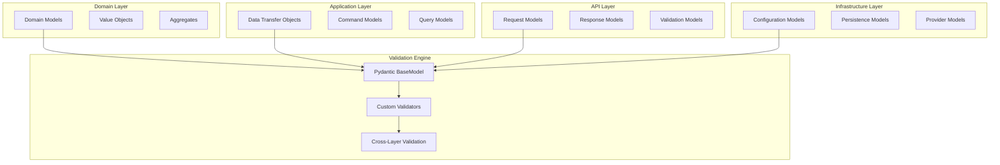

# Data Models and Validation

The Open Host Factory Plugin implements comprehensive data validation using Pydantic models throughout all layers, ensuring type safety, data integrity, and consistent validation across the entire system.

## Data Model Architecture



## Value Object Architecture (Updated)

### Domain Value Objects Decomposition

The system uses a **decomposed value object architecture** with orchestrator patterns for maintainability and single responsibility:

#### **Machine Value Objects**
```python
# Orchestrator import (backward compatible)
from src.domain.machine.value_objects import MachineStatus, PriceType, MachineId

# Direct imports from decomposed modules
from src.domain.machine.machine_status import MachineStatus
from src.domain.machine.machine_identifiers import MachineId, MachineType  
from src.domain.machine.machine_metadata import PriceType, MachineConfiguration
```

**Structure:**
- `machine_status.py` - Runtime states and transitions (MachineStatus)
- `machine_identifiers.py` - Core identification (MachineId, MachineType)
- `machine_metadata.py` - Configuration and metadata (PriceType, MachineConfiguration, events)
- `value_objects.py` - Orchestrator for backward compatibility

#### **Request Value Objects**
```python
# Orchestrator import (backward compatible)
from src.domain.request.value_objects import RequestType, RequestStatus, RequestId

# Direct imports from decomposed modules
from src.domain.request.request_types import RequestType, RequestStatus
from src.domain.request.request_identifiers import RequestId, MachineReference
from src.domain.request.request_metadata import RequestTimeout, MachineCount
```

**Structure:**
- `request_types.py` - Request types and statuses (RequestType, RequestStatus, MachineResult)
- `request_identifiers.py` - Request identification (RequestId, MachineReference, ResourceIdentifier)
- `request_metadata.py` - Request metadata (RequestTimeout, MachineCount, RequestTag, etc.)
- `value_objects.py` - Orchestrator for backward compatibility

### Benefits of Decomposed Architecture

1. **Single Responsibility**: Each file has a clear, focused purpose
2. **Maintainability**: Smaller, focused modules are easier to understand and modify
3. **Testability**: Individual components can be tested in isolation
4. **Backward Compatibility**: Orchestrator pattern maintains existing import patterns
5. **Extensibility**: Easy to add new value objects without affecting existing code

## Pydantic Model Architecture

### Base Model Configuration

All models inherit from a configured Pydantic BaseModel:

```python
from pydantic import BaseModel, ConfigDict
from typing import Any, Dict

class BaseValidatedModel(BaseModel):
    """Base model with common configuration for all validated models."""

    model_config = ConfigDict(
        # Validation settings
        validate_assignment=True,
        validate_default=True,
        extra='forbid',

        # Serialization settings
        use_enum_values=True,
        populate_by_name=True,

        # Performance settings
        arbitrary_types_allowed=True,

        # JSON schema settings
        json_schema_extra={
            "examples": []
        }
    )

    def model_dump_safe(self) -> Dict[str, Any]:
        """Safely dump model excluding sensitive fields."""
        return self.model_dump(exclude={'password', 'secret_key', 'token'})
```

## Domain Layer Models

### Value Objects

Rich value objects with business validation:

```python
from pydantic import Field, field_validator
import re
from typing import ClassVar

class ResourceId(BaseValidatedModel):
    """Base class for resource identifiers with validation."""
    value: str = Field(..., min_length=1, max_length=255)
    resource_type: ClassVar[str] = "Resource"

    @field_validator('value')
    @classmethod
    def validate_format(cls, v: str) -> str:
        """Validate resource ID format."""
        if not v.strip():
            raise ValueError("Resource ID cannot be empty")
        return v.strip()

    def __str__(self) -> str:
        return self.value

class TemplateId(ResourceId):
    """Template identifier with specific validation."""
    resource_type: ClassVar[str] = "Template"

    @field_validator('value')
    @classmethod
    def validate_template_format(cls, v: str) -> str:
        """Validate template ID format."""
        pattern = r'^template-[a-zA-Z0-9_-]+$'
        if not re.match(pattern, v):
            raise ValueError(f"Template ID must match pattern: {pattern}")
        return v

class RequestId(ResourceId):
    """Request identifier with UUID validation."""
    resource_type: ClassVar[str] = "Request"

    @field_validator('value')
    @classmethod
    def validate_request_format(cls, v: str) -> str:
        """Validate request ID format."""
        pattern = r'^(req|ret)-[0-9a-f]{8}-[0-9a-f]{4}-[0-9a-f]{4}-[0-9a-f]{4}-[0-9a-f]{12}$'
        if not re.match(pattern, v):
            raise ValueError(f"Request ID must match pattern: {pattern}")
        return v

class MachineId(ResourceId):
    """Machine identifier with validation."""
    resource_type: ClassVar[str] = "Machine"

    @field_validator('value')
    @classmethod
    def validate_machine_format(cls, v: str) -> str:
        """Validate machine ID format."""
        pattern = r'^machine-[a-zA-Z0-9_-]+$'
        if not re.match(pattern, v):
            raise ValueError(f"Machine ID must match pattern: {pattern}")
        return v
```

### Domain Aggregates

Domain aggregates with business rule validation:

```python
from datetime import datetime
from typing import Optional, Dict, Any, List
from enum import Enum

class RequestStatus(str, Enum):
    """Request status enumeration."""
    PENDING = "PENDING"
    IN_PROGRESS = "IN_PROGRESS"
    COMPLETED = "COMPLETED"
    FAILED = "FAILED"

class RequestType(str, Enum):
    """Request type enumeration."""
    PROVISION = "PROVISION"
    RETURN = "RETURN"

class Request(BaseValidatedModel):
    """Request aggregate with comprehensive validation."""

    request_id: RequestId
    template_id: TemplateId
    machine_count: int = Field(..., ge=1, le=1000)
    status: RequestStatus = RequestStatus.PENDING
    request_type: RequestType = RequestType.PROVISION
    created_at: datetime = Field(default_factory=datetime.utcnow)
    updated_at: Optional[datetime] = None
    completed_at: Optional[datetime] = None
    tags: Optional[Dict[str, str]] = Field(default_factory=dict)
    metadata: Optional[Dict[str, Any]] = Field(default_factory=dict)
    machine_ids: List[MachineId] = Field(default_factory=list)

    @field_validator('machine_count')
    @classmethod
    def validate_machine_count(cls, v: int, info) -> int:
        """Validate machine count based on request type."""
        if hasattr(info, 'data') and info.data.get('request_type') == RequestType.RETURN:
            # For return requests, machine_count should match machine_ids length
            machine_ids = info.data.get('machine_ids', [])
            if machine_ids and len(machine_ids) != v:
                raise ValueError("Machine count must match number of machine IDs for return requests")
        return v

    @field_validator('tags')
    @classmethod
    def validate_tags(cls, v: Optional[Dict[str, str]]) -> Optional[Dict[str, str]]:
        """Validate tag format."""
        if not v:
            return v

        for key, value in v.items():
            if not re.match(r'^[a-zA-Z0-9_.-]{1,128}$', key):
                raise ValueError(f"Invalid tag key format: {key}")
            if len(value) > 256:
                raise ValueError(f"Tag value too long: {key}")

        return v

    @field_validator('completed_at')
    @classmethod
    def validate_completion_time(cls, v: Optional[datetime], info) -> Optional[datetime]:
        """Validate completion time logic."""
        if v and hasattr(info, 'data'):
            created_at = info.data.get('created_at')
            if created_at and v < created_at:
                raise ValueError("Completion time cannot be before creation time")
        return v

    def complete_request(self, machine_ids: List[str]) -> None:
        """Complete the request with validation."""
        if self.status != RequestStatus.IN_PROGRESS:
            raise ValueError(f"Cannot complete request in status: {self.status}")

        if len(machine_ids) != self.machine_count:
            raise ValueError(f"Expected {self.machine_count} machines, got {len(machine_ids)}")

        self.machine_ids = [MachineId(value=mid) for mid in machine_ids]
        self.status = RequestStatus.COMPLETED
        self.completed_at = datetime.utcnow()
        self.updated_at = datetime.utcnow()
```

## Application Layer Models

### Data Transfer Objects (DTOs)

```python
from typing import Optional, List, Dict, Any

class RequestDTO(BaseValidatedModel):
    """Request data transfer object."""

    request_id: str
    template_id: str
    machine_count: int = Field(..., ge=1, le=1000)
    status: str
    request_type: str
    created_at: datetime
    updated_at: Optional[datetime] = None
    completed_at: Optional[datetime] = None
    tags: Optional[Dict[str, str]] = None
    machine_ids: Optional[List[str]] = None

    @classmethod
    def from_domain(cls, request: Request) -> 'RequestDTO':
        """Create DTO from domain model."""
        return cls(
            request_id=request.request_id.value,
            template_id=request.template_id.value,
            machine_count=request.machine_count,
            status=request.status.value,
            request_type=request.request_type.value,
            created_at=request.created_at,
            updated_at=request.updated_at,
            completed_at=request.completed_at,
            tags=request.tags,
            machine_ids=[mid.value for mid in request.machine_ids] if request.machine_ids else None
        )

    def to_domain(self) -> Request:
        """Convert DTO to domain model."""
        return Request(
            request_id=RequestId(value=self.request_id),
            template_id=TemplateId(value=self.template_id),
            machine_count=self.machine_count,
            status=RequestStatus(self.status),
            request_type=RequestType(self.request_type),
            created_at=self.created_at,
            updated_at=self.updated_at,
            completed_at=self.completed_at,
            tags=self.tags or {},
            machine_ids=[MachineId(value=mid) for mid in (self.machine_ids or [])]
        )

class TemplateDTO(BaseValidatedModel):
    """Infrastructure DTO for template data transfer and persistence."""
    model_config = ConfigDict(
        frozen=False,
        validate_assignment=True,
        populate_by_name=True
    )

    # Core template identification
    template_id: str = Field(description="Unique template identifier")
    name: Optional[str] = Field(default=None, description="Human-readable template name")
    description: Optional[str] = Field(default=None, description="Template description")

    # Provider configuration
    provider_api: str = Field(description="Provider API type (aws, azure, etc.)")
    provider_type: Optional[str] = Field(default=None, description="Provider type")
    provider_name: Optional[str] = Field(default=None, description="Provider instance name")

    # Template configuration data
    configuration: Dict[str, Any] = Field(default_factory=dict, description="Template configuration")

    # Metadata and status
    metadata: Dict[str, Any] = Field(default_factory=dict, description="Template metadata")
    tags: Dict[str, str] = Field(default_factory=dict, description="Template tags")
    is_active: bool = Field(default=True, description="Whether template is active")

    # Timestamps
    created_at: Optional[datetime] = Field(default=None, description="Creation timestamp")
    updated_at: Optional[datetime] = Field(default=None, description="Last update timestamp")

    # File metadata
    source_file: Optional[str] = Field(default=None, description="Source file path")
    file_priority: Optional[int] = Field(default=None, description="File priority in hierarchy")

    def to_dict(self) -> Dict[str, Any]:
        """Convert DTO to dictionary for serialization."""
        return self.model_dump(exclude_none=True)

    @classmethod
    def from_dict(cls, data: Dict[str, Any]) -> 'TemplateDTO':
        """Create DTO from dictionary data."""
        return cls(**data)

    def to_domain(self) -> 'Template':
        """Convert infrastructure DTO to domain Template aggregate."""
        from src.domain.template.aggregate import Template

        return Template(
            template_id=self.template_id,
            name=self.name,
            description=self.description,
            provider_api=self.provider_api,
            provider_type=self.provider_type,
            provider_name=self.provider_name,
            configuration=self.configuration,
            metadata=self.metadata,
            tags=self.tags,
            is_active=self.is_active,
            created_at=self.created_at,
            updated_at=self.updated_at
        )

    @classmethod
    def from_domain(cls, template: 'Template') -> 'TemplateDTO':
        """Create infrastructure DTO from domain Template aggregate."""
        return cls(
            template_id=template.template_id,
            name=template.name,
            description=template.description,
            provider_api=template.provider_api or 'aws',
            provider_type=template.provider_type,
            provider_name=template.provider_name,
            configuration=template.configuration if hasattr(template, 'configuration') else {},
            metadata=template.metadata if hasattr(template, 'metadata') else {},
            tags=template.tags if hasattr(template, 'tags') else {},
            is_active=template.is_active if hasattr(template, 'is_active') else True,
            created_at=template.created_at if hasattr(template, 'created_at') else None,
            updated_at=template.updated_at if hasattr(template, 'updated_at') else None
        )

class TemplateCacheEntryDTO(BaseValidatedModel):
    """DTO for template cache entries with metadata."""
    model_config = ConfigDict(frozen=True)

    template: TemplateDTO = Field(description="Cached template data")
    cached_at: datetime = Field(description="Cache timestamp")
    ttl_seconds: int = Field(description="Time to live in seconds")
    hit_count: int = Field(default=0, description="Number of cache hits")

    @property
    def is_expired(self) -> bool:
        """Check if cache entry is expired."""
        age_seconds = (datetime.now() - self.cached_at).total_seconds()
        return age_seconds > self.ttl_seconds

    @property
    def age_seconds(self) -> float:
        """Get age of cache entry in seconds."""
        return (datetime.now() - self.cached_at).total_seconds()

class TemplateValidationResultDTO(BaseValidatedModel):
    """DTO for template validation results."""
    model_config = ConfigDict(frozen=True)

    template_id: str = Field(description="Template identifier")
    is_valid: bool = Field(description="Whether template is valid")
    errors: List[str] = Field(default_factory=list, description="Validation errors")
    warnings: List[str] = Field(default_factory=list, description="Validation warnings")
    supported_features: List[str] = Field(default_factory=list, description="Supported features")
    validation_time: datetime = Field(default_factory=datetime.now, description="Validation timestamp")
    provider_instance: Optional[str] = Field(default=None, description="Provider instance validated against")
```

### Command and Query Models

```python
class CreateRequestCommand(BaseValidatedModel):
    """Command to create a new request."""

    template_id: str = Field(..., min_length=1)
    machine_count: int = Field(..., ge=1, le=1000)
    tags: Optional[Dict[str, str]] = Field(default_factory=dict)
    priority: Optional[int] = Field(None, ge=1, le=10)
    timeout: Optional[int] = Field(None, ge=60, le=3600)

    @field_validator('template_id')
    @classmethod
    def validate_template_id(cls, v: str) -> str:
        """Validate template ID exists."""
        # This would typically check against a repository
        if not v.startswith('template-'):
            raise ValueError("Template ID must start with 'template-'")
        return v

class GetRequestStatusQuery(BaseValidatedModel):
    """Query to get request status."""

    request_id: str = Field(..., min_length=1)
    include_machines: bool = Field(default=False)
    include_history: bool = Field(default=False)

    @field_validator('request_id')
    @classmethod
    def validate_request_id_format(cls, v: str) -> str:
        """Validate request ID format."""
        pattern = r'^(req|ret)-[0-9a-f]{8}-[0-9a-f]{4}-[0-9a-f]{4}-[0-9a-f]{4}-[0-9a-f]{12}$'
        if not re.match(pattern, v):
            raise ValueError(f"Invalid request ID format: {v}")
        return v

class ListRequestsQuery(BaseValidatedModel):
    """Query to list requests with filtering."""

    status: Optional[str] = Field(None, regex=r'^(PENDING|IN_PROGRESS|COMPLETED|FAILED)$')
    template_id: Optional[str] = None
    limit: int = Field(default=50, ge=1, le=1000)
    offset: int = Field(default=0, ge=0)
    order_by: str = Field(default="created_at", regex=r'^(created_at|updated_at|status)$')
    order_direction: str = Field(default="desc", regex=r'^(asc|desc)$')

    @field_validator('template_id')
    @classmethod
    def validate_template_id_filter(cls, v: Optional[str]) -> Optional[str]:
        """Validate template ID filter."""
        if v and not v.startswith('template-'):
            raise ValueError("Template ID must start with 'template-'")
        return v
```

## API Layer Models

### Request/Response Models

```python
class CreateRequestRequest(BaseValidatedModel):
    """API request model for creating requests."""

    template_id: str = Field(..., description="Template ID to use for provisioning")
    machine_count: int = Field(..., ge=1, le=100, description="Number of machines to provision")
    tags: Optional[Dict[str, str]] = Field(None, description="Optional tags for the request")
    priority: Optional[int] = Field(None, ge=1, le=10, description="Request priority (1-10)")

    model_config = ConfigDict(
        json_schema_extra={
            "example": {
                "template_id": "template-web-server",
                "machine_count": 3,
                "tags": {
                    "environment": "production",
                    "team": "backend"
                },
                "priority": 5
            }
        }
    )

class RequestStatusResponse(BaseValidatedModel):
    """API response model for request status."""

    request_id: str
    status: str
    template_id: str
    machine_count: int
    machines_ready: int = Field(default=0)
    machines_pending: int = Field(default=0)
    machines_failed: int = Field(default=0)
    created_at: datetime
    updated_at: Optional[datetime] = None
    estimated_completion: Optional[datetime] = None
    machines: Optional[List[Dict[str, Any]]] = None

    @field_validator('machines_ready', 'machines_pending', 'machines_failed')
    @classmethod
    def validate_machine_counts(cls, v: int, info) -> int:
        """Validate machine counts are consistent."""
        if hasattr(info, 'data'):
            machine_count = info.data.get('machine_count', 0)
            if v > machine_count:
                raise ValueError(f"Machine count cannot exceed total: {machine_count}")
        return v

class ErrorResponse(BaseValidatedModel):
    """Standard error response model."""

    error: str = Field(..., description="Error message")
    error_code: str = Field(..., description="Error code")
    timestamp: datetime = Field(default_factory=datetime.utcnow)
    request_id: Optional[str] = Field(None, description="Request ID if applicable")
    details: Optional[Dict[str, Any]] = Field(None, description="Additional error details")

    model_config = ConfigDict(
        json_schema_extra={
            "example": {
                "error": "Template not found",
                "error_code": "TEMPLATE_NOT_FOUND",
                "timestamp": "2025-06-30T12:00:00Z",
                "request_id": "req-12345678-1234-1234-1234-123456789012",
                "details": {
                    "template_id": "template-invalid"
                }
            }
        }
    )
```

## Configuration Models

### Type-Safe Configuration

```python
class AWSConfig(BaseValidatedModel):
    """AWS provider configuration with validation."""

    region: str = Field(default="us-east-1", regex=r'^[a-z]{2}-[a-z]+-\d$')
    profile: Optional[str] = Field(default="default")
    access_key_id: Optional[str] = Field(None, min_length=16, max_length=32)
    secret_access_key: Optional[str] = Field(None, min_length=40)
    session_token: Optional[str] = None
    endpoint_url: Optional[str] = Field(None, regex=r'^https?://.+')

    @field_validator('region')
    @classmethod
    def validate_aws_region(cls, v: str) -> str:
        """Validate AWS region format."""
        valid_regions = [
            'us-east-1', 'us-east-2', 'us-west-1', 'us-west-2',
            'eu-west-1', 'eu-west-2', 'eu-central-1',
            'ap-southeast-1', 'ap-southeast-2', 'ap-northeast-1'
        ]
        if v not in valid_regions:
            raise ValueError(f"Invalid AWS region: {v}")
        return v

class StorageConfig(BaseValidatedModel):
    """Storage configuration with strategy validation."""

    strategy: str = Field(..., regex=r'^(json|sql|dynamodb)$')
    json_strategy: Optional[Dict[str, Any]] = None
    sql_strategy: Optional[Dict[str, Any]] = None
    dynamodb_strategy: Optional[Dict[str, Any]] = None

    @field_validator('json_strategy', 'sql_strategy', 'dynamodb_strategy')
    @classmethod
    def validate_strategy_config(cls, v: Optional[Dict[str, Any]], info) -> Optional[Dict[str, Any]]:
        """Validate strategy configuration matches selected strategy."""
        if not hasattr(info, 'data'):
            return v

        strategy = info.data.get('strategy')
        field_name = info.field_name

        # Check if the correct strategy config is provided
        if strategy == 'json' and field_name == 'json_strategy' and not v:
            raise ValueError("json_strategy is required when strategy is 'json'")
        elif strategy == 'sql' and field_name == 'sql_strategy' and not v:
            raise ValueError("sql_strategy is required when strategy is 'sql'")
        elif strategy == 'dynamodb' and field_name == 'dynamodb_strategy' and not v:
            raise ValueError("dynamodb_strategy is required when strategy is 'dynamodb'")

        return v

class AppConfig(BaseValidatedModel):
    """Complete application configuration."""

    version: str = Field(default="2.0.0", regex=r'^\d+\.\d+\.\d+$')
    environment: str = Field(default="development", regex=r'^(development|staging|production)$')
    debug: bool = Field(default=False)
    provider: Dict[str, Any] = Field(...)
    storage: StorageConfig = Field(...)
    logging: Dict[str, Any] = Field(default_factory=dict)
    template: Dict[str, Any] = Field(default_factory=dict)
    events: Dict[str, Any] = Field(default_factory=dict)
    naming: Dict[str, Any] = Field(default_factory=dict)
    resilience: Dict[str, Any] = Field(default_factory=dict)

    @field_validator('debug')
    @classmethod
    def validate_debug_environment(cls, v: bool, info) -> bool:
        """Validate debug setting for production."""
        if hasattr(info, 'data'):
            environment = info.data.get('environment')
            if environment == 'production' and v:
                raise ValueError("Debug mode should not be enabled in production")
        return v
```

## Cross-Layer Validation

### Model Consistency Validation

```python
class ModelValidator:
    """Cross-layer model validation utilities."""

    @staticmethod
    def validate_request_template_consistency(request: Request, template: Template) -> List[str]:
        """Validate request is consistent with template."""
        errors = []

        # Check machine count doesn't exceed template maximum
        if request.machine_count > template.max_number:
            errors.append(f"Machine count {request.machine_count} exceeds template maximum {template.max_number}")

        # Check template is active
        if not template.is_active:
            errors.append(f"Template {template.template_id} is not active")

        return errors

    @staticmethod
    def validate_machine_request_consistency(machine: Machine, request: Request) -> List[str]:
        """Validate machine is consistent with request."""
        errors = []

        # Check machine belongs to request
        if machine.request_id != request.request_id:
            errors.append(f"Machine {machine.machine_id} does not belong to request {request.request_id}")

        # Check template consistency
        if machine.template_id != request.template_id:
            errors.append(f"Machine template {machine.template_id} does not match request template {request.template_id}")

        return errors

class ValidationService:
    """Service for comprehensive validation across layers."""

    def __init__(self, template_repository, request_repository):
        self.template_repository = template_repository
        self.request_repository = request_repository

    async def validate_create_request_command(self, command: CreateRequestCommand) -> List[str]:
        """Validate create request command with repository checks."""
        errors = []

        # Validate command structure
        try:
            command.model_validate(command.model_dump())
        except ValidationError as e:
            errors.extend([str(error) for error in e.errors()])

        # Check template exists
        template = await self.template_repository.get_by_id(command.template_id)
        if not template:
            errors.append(f"Template {command.template_id} not found")
        elif template:
            # Check machine count against template
            if command.machine_count > template.max_number:
                errors.append(f"Machine count exceeds template maximum: {template.max_number}")

        return errors
```

## Custom Validators

### Business Rule Validators

```python
from pydantic import field_validator, model_validator
from typing import Any, Dict

class BusinessRuleValidator:
    """Custom validators for business rules."""

    @staticmethod
    def validate_aws_resource_id(resource_type: str, resource_id: str) -> str:
        """Validate AWS resource ID format."""
        patterns = {
            'instance': r'^i-[a-f0-9]{8,17}$',
            'ami': r'^ami-[a-f0-9]{8,17}$',
            'subnet': r'^subnet-[a-f0-9]{8,17}$',
            'security_group': r'^sg-[a-f0-9]{8,17}$',
            'vpc': r'^vpc-[a-f0-9]{8,17}$'
        }

        pattern = patterns.get(resource_type)
        if not pattern:
            raise ValueError(f"Unknown AWS resource type: {resource_type}")

        if not re.match(pattern, resource_id):
            raise ValueError(f"Invalid {resource_type} ID format: {resource_id}")

        return resource_id

    @staticmethod
    def validate_machine_count_limits(machine_count: int, template_max: int, global_max: int) -> int:
        """Validate machine count against multiple limits."""
        if machine_count <= 0:
            raise ValueError("Machine count must be positive")

        if machine_count > template_max:
            raise ValueError(f"Machine count {machine_count} exceeds template limit {template_max}")

        if machine_count > global_max:
            raise ValueError(f"Machine count {machine_count} exceeds global limit {global_max}")

        return machine_count

# Usage in models
class ValidatedTemplate(BaseValidatedModel):
    """Template with business rule validation."""

    template_id: str
    image_id: str
    subnet_ids: List[str]
    security_group_ids: List[str]
    max_number: int = Field(..., ge=1, le=1000)

    @field_validator('image_id')
    @classmethod
    def validate_ami_id(cls, v: str) -> str:
        """Validate AMI ID format."""
        return BusinessRuleValidator.validate_aws_resource_id('ami', v)

    @field_validator('subnet_ids')
    @classmethod
    def validate_subnet_ids(cls, v: List[str]) -> List[str]:
        """Validate subnet ID formats."""
        return [BusinessRuleValidator.validate_aws_resource_id('subnet', sid) for sid in v]

    @field_validator('security_group_ids')
    @classmethod
    def validate_sg_ids(cls, v: List[str]) -> List[str]:
        """Validate security group ID formats."""
        return [BusinessRuleValidator.validate_aws_resource_id('security_group', sgid) for sgid in v]

    @model_validator(mode='after')
    def validate_template_consistency(self) -> 'ValidatedTemplate':
        """Validate template internal consistency."""
        # Business rule: templates with high machine counts need multiple subnets
        if self.max_number > 50 and len(self.subnet_ids) < 2:
            raise ValueError("Templates with max_number > 50 require at least 2 subnets")

        return self
```

## Validation Best Practices

### Model Design Principles

1. **Single Responsibility**: Each model has a clear, focused purpose
2. **Immutability**: Use frozen models where appropriate
3. **Validation at Boundaries**: Validate data at system boundaries
4. **Business Rules**: Encode business rules in validators
5. **Error Messages**: Provide clear, actionable error messages

### Performance Considerations

1. **Lazy Validation**: Use lazy validation for expensive checks
2. **Caching**: Cache validation results where appropriate
3. **Batch Validation**: Validate multiple items together
4. **Async Validation**: Use async validators for I/O operations

### Testing Validation

```python
import pytest
from pydantic import ValidationError

class TestRequestValidation:
    """Test request model validation."""

    def test_valid_request_creation(self):
        """Test creating valid request."""
        request_data = {
            "request_id": "req-12345678-1234-1234-1234-123456789012",
            "template_id": "template-web-server",
            "machine_count": 3
        }

        request = Request(**request_data)
        assert request.request_id.value == request_data["request_id"]
        assert request.machine_count == 3

    def test_invalid_machine_count(self):
        """Test validation of invalid machine count."""
        request_data = {
            "request_id": "req-12345678-1234-1234-1234-123456789012",
            "template_id": "template-web-server",
            "machine_count": 0  # Invalid
        }

        with pytest.raises(ValidationError) as exc_info:
            Request(**request_data)

        assert "machine_count" in str(exc_info.value)

    def test_invalid_request_id_format(self):
        """Test validation of invalid request ID format."""
        request_data = {
            "request_id": "invalid-id",  # Invalid format
            "template_id": "template-web-server",
            "machine_count": 3
        }

        with pytest.raises(ValidationError) as exc_info:
            Request(**request_data)

        assert "Request ID must match pattern" in str(exc_info.value)
```

## Next Steps

- **[Dependency Injection](dependency_injection.md)**: Learn about the DI architecture
- **[Storage Strategies](../user_guide/storage_strategies.md)**: Understand data persistence
- **[Provider Architecture](providers.md)**: Learn about provider models
- **[Configuration Reference](../configuration/native-spec-config.md)**: Complete configuration validation
