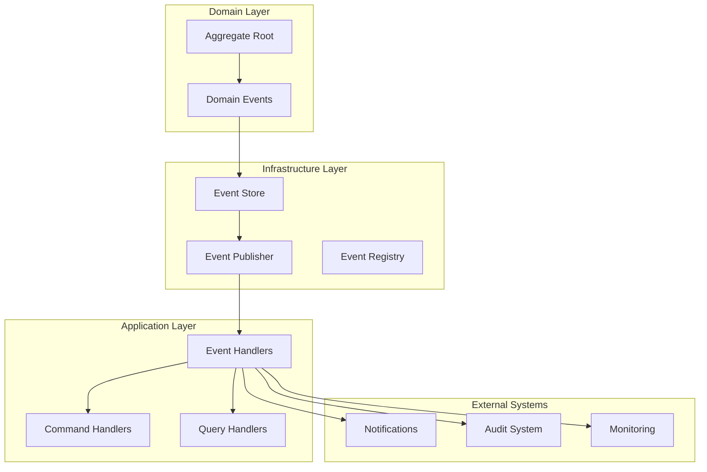

# Event System

The Open Host Factory Plugin implements a sophisticated event-driven architecture with 47+ specialized event handlers, domain events, and event sourcing capabilities. This system enables loose coupling, audit trails, and reactive programming patterns.

## Event Architecture Overview

### Event-Driven Design Principles

The event system is built on these core principles:

- **Domain Events**: Business state changes generate events
- **Event Sourcing**: Complete audit trail of all operations
- **Loose Coupling**: Components communicate through events
- **Reactive Processing**: Asynchronous event handling
- **Scalability**: Event-driven architecture supports horizontal scaling

### Event Flow Architecture



## Domain Events

### Event Generation

Domain events are generated by aggregates when significant business state changes occur:

```python
class Request(AggregateRoot):
    def complete_successfully(self, machine_ids: List[str]) -> None:
        # Update business state
        self.status = RequestStatus.COMPLETED
        self.machine_ids = machine_ids
        self.completed_at = datetime.utcnow()

        # Generate domain event
        self._add_domain_event(RequestCompletedEvent(
            request_id=self.request_id,
            machine_ids=machine_ids,
            completed_at=self.completed_at,
            template_id=self.template_id,
            machine_count=len(machine_ids)
        ))
```

### Event Types

#### Template Events

Events related to template management and lifecycle operations:

```python
@dataclass(frozen=True)
class TemplateCreatedEvent(DomainEvent):
    template_id: str
    template_name: str
    template_type: str
    timestamp: datetime

@dataclass(frozen=True)
class TemplateUpdatedEvent(DomainEvent):
    template_id: str
    template_name: str
    changes: Dict[str, Any]
    timestamp: datetime

@dataclass(frozen=True)
class TemplateDeletedEvent(DomainEvent):
    template_id: str
    deletion_reason: str
    timestamp: datetime

@dataclass(frozen=True)
class TemplateValidatedEvent(DomainEvent):
    template_id: str
    template_name: str
    validation_result: str
    timestamp: datetime
```

**Template Event Publishing Integration**

The `TemplateConfigurationManager` supports optional event publishing for template operations. When an `EventPublisherPort` is provided during initialization, template lifecycle events are automatically published:

```python
class TemplateConfigurationManager:
    def __init__(self, 
                 config_manager: ConfigurationManager,
                 scheduler_strategy: SchedulerPort,
                 logger: LoggingPort,
                 event_publisher: Optional[EventPublisherPort] = None):
        self.event_publisher = event_publisher
        # ... other initialization

    async def save_template(self, template: TemplateDTO) -> None:
        """Save template with optional event publishing."""
        existing_template = await self.get_template_by_id(template.template_id)
        is_update = existing_template is not None

        # Perform save operation
        await self._perform_save_operation(template)

        # Publish domain event if event publisher is available
        if self.event_publisher and self.event_publisher.is_enabled():
            if is_update:
                event = TemplateUpdatedEvent(
                    template_id=template.template_id,
                    template_name=template.name or template.template_id,
                    changes=self._calculate_changes(existing_template, template),
                    timestamp=datetime.utcnow()
                )
            else:
                event = TemplateCreatedEvent(
                    template_id=template.template_id,
                    template_name=template.name or template.template_id,
                    template_type=template.provider_api or 'aws',
                    timestamp=datetime.utcnow()
                )

            self.event_publisher.publish(event)
```

#### Machine Events

Events related to machine lifecycle:

```python
@dataclass(frozen=True)
class MachineCreatedEvent(DomainEvent):
    machine_id: str
    template_id: str
    request_id: str
    instance_type: str
    provider_instance_id: str
    created_at: datetime

@dataclass(frozen=True)
class MachineStatusChangedEvent(DomainEvent):
    machine_id: str
    old_status: MachineStatus
    new_status: MachineStatus
    changed_at: datetime
    reason: Optional[str] = None

@dataclass(frozen=True)
class MachineTerminatedEvent(DomainEvent):
    machine_id: str
    request_id: str
    terminated_at: datetime
    termination_reason: str
```

#### Request Events

Events related to request processing:

```python
@dataclass(frozen=True)
class RequestCreatedEvent(DomainEvent):
    request_id: str
    template_id: str
    machine_count: int
    request_type: RequestType
    created_at: datetime
    tags: Optional[Dict[str, str]] = None

@dataclass(frozen=True)
class RequestStatusChangedEvent(DomainEvent):
    request_id: str
    old_status: RequestStatus
    new_status: RequestStatus
    changed_at: datetime
    reason: Optional[str] = None

@dataclass(frozen=True)
class RequestCompletedEvent(DomainEvent):
    request_id: str
    machine_ids: List[str]
    completed_at: datetime
    template_id: str
    machine_count: int
    duration_seconds: int
```

## Event Handlers

### Event Handler Architecture

The system includes 47+ specialized event handlers organized by concern:

#### Base Event Handler

```python
class BaseEventHandler(ABC):
    """Base class for all event handlers."""

    def __init__(self):
        self.logger = get_logger(self.__class__.__name__)

    @abstractmethod
    async def handle(self, event: DomainEvent) -> None:
        """Handle the domain event."""
        pass

    def can_handle(self, event: DomainEvent) -> bool:
        """Check if this handler can process the event."""
        return True

    async def handle_with_error_recovery(self, event: DomainEvent) -> None:
        """Handle event with error recovery."""
        try:
            await self.handle(event)
            self.logger.debug(f"Successfully handled {event.event_type}")
        except Exception as e:
            self.logger.error(f"Failed to handle {event.event_type}: {str(e)}")
            await self.handle_error(event, e)

    async def handle_error(self, event: DomainEvent, error: Exception) -> None:
        """Handle event processing errors."""
        # Default error handling - can be overridden
        pass
```

### Audit Event Handlers

#### Request Audit Handler

```python
class RequestAuditHandler(BaseEventHandler):
    """Handles audit logging for request events."""

    def __init__(self, audit_service: AuditService):
        super().__init__()
        self._audit_service = audit_service

    async def handle(self, event: DomainEvent) -> None:
        if isinstance(event, RequestCreatedEvent):
            await self._handle_request_created(event)
        elif isinstance(event, RequestStatusChangedEvent):
            await self._handle_request_status_changed(event)
        elif isinstance(event, RequestCompletedEvent):
            await self._handle_request_completed(event)

    async def _handle_request_created(self, event: RequestCreatedEvent) -> None:
        await self._audit_service.log_event(
            event_type="REQUEST_CREATED",
            resource_id=event.request_id,
            details={
                "template_id": event.template_id,
                "machine_count": event.machine_count,
                "request_type": event.request_type.value,
                "created_at": event.created_at.isoformat(),
                "tags": event.tags or {}
            }
        )

    async def _handle_request_status_changed(self, event: RequestStatusChangedEvent) -> None:
        await self._audit_service.log_event(
            event_type="REQUEST_STATUS_CHANGED",
            resource_id=event.request_id,
            details={
                "old_status": event.old_status.value,
                "new_status": event.new_status.value,
                "changed_at": event.changed_at.isoformat(),
                "reason": event.reason
            }
        )
```

#### Machine Audit Handler

```python
class MachineAuditHandler(BaseEventHandler):
    """Handles audit logging for machine events."""

    def __init__(self, audit_service: AuditService):
        super().__init__()
        self._audit_service = audit_service

    async def handle(self, event: DomainEvent) -> None:
        if isinstance(event, MachineCreatedEvent):
            await self._handle_machine_created(event)
        elif isinstance(event, MachineStatusChangedEvent):
            await self._handle_machine_status_changed(event)
        elif isinstance(event, MachineTerminatedEvent):
            await self._handle_machine_terminated(event)

    async def _handle_machine_created(self, event: MachineCreatedEvent) -> None:
        await self._audit_service.log_event(
            event_type="MACHINE_CREATED",
            resource_id=event.machine_id,
            details={
                "template_id": event.template_id,
                "request_id": event.request_id,
                "instance_type": event.instance_type,
                "provider_instance_id": event.provider_instance_id,
                "created_at": event.created_at.isoformat()
            }
        )
```

#### Template Audit Handler

```python
class TemplateAuditHandler(BaseEventHandler):
    """Handles audit logging for template events."""

    def __init__(self, audit_service: AuditService):
        super().__init__()
        self._audit_service = audit_service

    async def handle(self, event: DomainEvent) -> None:
        if isinstance(event, TemplateCreatedEvent):
            await self._handle_template_created(event)
        elif isinstance(event, TemplateUpdatedEvent):
            await self._handle_template_updated(event)
        elif isinstance(event, TemplateDeletedEvent):
            await self._handle_template_deleted(event)
        elif isinstance(event, TemplateValidatedEvent):
            await self._handle_template_validated(event)

    async def _handle_template_created(self, event: TemplateCreatedEvent) -> None:
        await self._audit_service.log_event(
            event_type="TEMPLATE_CREATED",
            resource_id=event.template_id,
            details={
                "template_name": event.template_name,
                "template_type": event.template_type,
                "created_at": event.timestamp.isoformat()
            }
        )

    async def _handle_template_updated(self, event: TemplateUpdatedEvent) -> None:
        await self._audit_service.log_event(
            event_type="TEMPLATE_UPDATED",
            resource_id=event.template_id,
            details={
                "template_name": event.template_name,
                "changes": event.changes,
                "updated_at": event.timestamp.isoformat()
            }
        )

    async def _handle_template_deleted(self, event: TemplateDeletedEvent) -> None:
        await self._audit_service.log_event(
            event_type="TEMPLATE_DELETED",
            resource_id=event.template_id,
            details={
                "deletion_reason": event.deletion_reason,
                "deleted_at": event.timestamp.isoformat()
            }
        )

    async def _handle_template_validated(self, event: TemplateValidatedEvent) -> None:
        await self._audit_service.log_event(
            event_type="TEMPLATE_VALIDATED",
            resource_id=event.template_id,
            details={
                "template_name": event.template_name,
                "validation_result": event.validation_result,
                "validated_at": event.timestamp.isoformat()
            }
        )
```

### Notification Event Handlers

#### Request Notification Handler

```python
class RequestNotificationHandler(BaseEventHandler):
    """Handles notifications for request events."""

    def __init__(self, notification_service: NotificationService):
        super().__init__()
        self._notification_service = notification_service

    async def handle(self, event: DomainEvent) -> None:
        if isinstance(event, RequestCompletedEvent):
            await self._handle_request_completed(event)
        elif isinstance(event, RequestStatusChangedEvent) and event.new_status == RequestStatus.FAILED:
            await self._handle_request_failed(event)

    async def _handle_request_completed(self, event: RequestCompletedEvent) -> None:
        if self._should_notify_completion(event):
            await self._notification_service.send_notification(
                title="Request Completed Successfully",
                message=f"Request {event.request_id} completed with {event.machine_count} machines",
                details={
                    "request_id": event.request_id,
                    "machine_ids": event.machine_ids,
                    "duration": f"{event.duration_seconds}s",
                    "template_id": event.template_id
                },
                severity="info"
            )

    async def _handle_request_failed(self, event: RequestStatusChangedEvent) -> None:
        await self._notification_service.send_notification(
            title="Request Failed",
            message=f"Request {event.request_id} failed: {event.reason}",
            details={
                "request_id": event.request_id,
                "failure_reason": event.reason,
                "failed_at": event.changed_at.isoformat()
            },
            severity="error"
        )
```

#### Error Notification Handler

```python
class ErrorNotificationHandler(BaseEventHandler):
    """Handles error notifications and alerting."""

    def __init__(self, alerting_service: AlertingService):
        super().__init__()
        self._alerting_service = alerting_service

    async def handle(self, event: DomainEvent) -> None:
        if self._is_error_event(event):
            await self._handle_error_event(event)

    def _is_error_event(self, event: DomainEvent) -> bool:
        error_indicators = [
            'Failed', 'Error', 'Timeout', 'Exception'
        ]
        return any(indicator in event.event_type for indicator in error_indicators)

    async def _handle_error_event(self, event: DomainEvent) -> None:
        severity = self._determine_severity(event)

        await self._alerting_service.send_alert(
            alert_type="SYSTEM_ERROR",
            severity=severity,
            message=f"Error event detected: {event.event_type}",
            details=event.to_dict(),
            timestamp=event.occurred_at
        )
```

### Workflow Event Handlers

#### Request Workflow Handler

```python
class RequestWorkflowHandler(BaseEventHandler):
    """Orchestrates multi-step request workflows."""

    def __init__(self, command_bus: CommandBus, provider_service: ProviderService):
        super().__init__()
        self._command_bus = command_bus
        self._provider_service = provider_service

    async def handle(self, event: DomainEvent) -> None:
        if isinstance(event, RequestCreatedEvent):
            await self._handle_request_created(event)
        elif isinstance(event, RequestStatusChangedEvent):
            await self._handle_request_status_changed(event)

    async def _handle_request_created(self, event: RequestCreatedEvent) -> None:
        # Start provisioning workflow
        command = StartProvisioningCommand(
            request_id=event.request_id,
            template_id=event.template_id,
            machine_count=event.machine_count
        )

        await self._command_bus.dispatch(command)

    async def _handle_request_status_changed(self, event: RequestStatusChangedEvent) -> None:
        if event.new_status == RequestStatus.COMPLETED:
            # Trigger post-completion workflows
            await self._handle_request_completion(event)
        elif event.new_status == RequestStatus.FAILED:
            # Trigger cleanup workflows
            await self._handle_request_failure(event)
```

#### Machine Workflow Handler

```python
class MachineWorkflowHandler(BaseEventHandler):
    """Manages machine provisioning workflows."""

    def __init__(self, machine_service: MachineService):
        super().__init__()
        self._machine_service = machine_service

    async def handle(self, event: DomainEvent) -> None:
        if isinstance(event, MachineCreatedEvent):
            await self._handle_machine_created(event)
        elif isinstance(event, MachineStatusChangedEvent):
            await self._handle_machine_status_changed(event)

    async def _handle_machine_created(self, event: MachineCreatedEvent) -> None:
        # Initialize machine monitoring
        await self._machine_service.start_monitoring(event.machine_id)

        # Configure machine if needed
        await self._machine_service.configure_machine(
            machine_id=event.machine_id,
            template_id=event.template_id
        )

    async def _handle_machine_status_changed(self, event: MachineStatusChangedEvent) -> None:
        if event.new_status == MachineStatus.RUNNING:
            # Machine is ready for use
            await self._machine_service.mark_machine_ready(event.machine_id)
        elif event.new_status == MachineStatus.TERMINATED:
            # Clean up machine resources
            await self._machine_service.cleanup_machine(event.machine_id)
```

### Monitoring Event Handlers

#### Metrics Collection Handler

```python
class MetricsCollectionHandler(BaseEventHandler):
    """Collects metrics from domain events."""

    def __init__(self, metrics_service: MetricsService):
        super().__init__()
        self._metrics_service = metrics_service

    async def handle(self, event: DomainEvent) -> None:
        # Collect general event metrics
        await self._metrics_service.increment_counter(
            "domain_events_total",
            tags={"event_type": event.event_type}
        )

        # Collect specific metrics based on event type
        if isinstance(event, RequestCreatedEvent):
            await self._collect_request_metrics(event)
        elif isinstance(event, MachineCreatedEvent):
            await self._collect_machine_metrics(event)
        elif isinstance(event, RequestCompletedEvent):
            await self._collect_completion_metrics(event)

    async def _collect_request_metrics(self, event: RequestCreatedEvent) -> None:
        await self._metrics_service.increment_counter(
            "requests_created_total",
            tags={
                "template_id": event.template_id,
                "request_type": event.request_type.value
            }
        )

        await self._metrics_service.record_histogram(
            "request_machine_count",
            value=event.machine_count,
            tags={"template_id": event.template_id}
        )

    async def _collect_completion_metrics(self, event: RequestCompletedEvent) -> None:
        await self._metrics_service.record_histogram(
            "request_duration_seconds",
            value=event.duration_seconds,
            tags={"template_id": event.template_id}
        )

        await self._metrics_service.increment_counter(
            "requests_completed_total",
            tags={"template_id": event.template_id}
        )
```

#### Performance Monitoring Handler

```python
class PerformanceMonitoringHandler(BaseEventHandler):
    """Monitors system performance through events."""

    def __init__(self, performance_service: PerformanceService):
        super().__init__()
        self._performance_service = performance_service

    async def handle(self, event: DomainEvent) -> None:
        # Track event processing latency
        processing_time = datetime.utcnow() - event.occurred_at

        await self._performance_service.record_latency(
            "event_processing_latency",
            latency_ms=processing_time.total_seconds() * 1000,
            tags={"event_type": event.event_type}
        )

        # Detect slow operations
        if processing_time.total_seconds() > 5.0:
            await self._performance_service.record_slow_operation(
                operation_type="event_processing",
                duration_seconds=processing_time.total_seconds(),
                details={
                    "event_type": event.event_type,
                    "event_id": event.event_id
                }
            )
```

## Event Sourcing

### Event Store Implementation

```python
class EventStore:
    """Persistent storage for domain events."""

    def __init__(self, storage_strategy: StorageStrategy):
        self._storage = storage_strategy
        self._logger = get_logger(__name__)

    async def append_events(self, 
                          aggregate_id: str, 
                          events: List[DomainEvent],
                          expected_version: int) -> None:
        """Append events to the store with optimistic concurrency control."""
        try:
            # Check for concurrent modifications
            current_version = await self._get_aggregate_version(aggregate_id)
            if current_version != expected_version:
                raise ConcurrencyConflictError(
                    f"Expected version {expected_version}, got {current_version}"
                )

            # Store events with deduplication
            for event in events:
                if not await self._event_exists(event.event_id):
                    await self._store_event(aggregate_id, event)
                    self._logger.debug(f"Stored event {event.event_id}")
                else:
                    self._logger.debug(f"Event {event.event_id} already exists, skipping")

        except Exception as e:
            self._logger.error(f"Failed to append events: {str(e)}")
            raise

    async def get_events(self, 
                        aggregate_id: str, 
                        from_version: int = 0) -> List[DomainEvent]:
        """Retrieve events for an aggregate from a specific version."""
        try:
            events = await self._storage.get_events_for_aggregate(
                aggregate_id, from_version
            )

            return [self._deserialize_event(event_data) for event_data in events]

        except Exception as e:
            self._logger.error(f"Failed to get events for {aggregate_id}: {str(e)}")
            raise

    async def get_all_events(self, 
                           from_timestamp: Optional[datetime] = None) -> List[DomainEvent]:
        """Retrieve all events from a specific timestamp."""
        try:
            events = await self._storage.get_all_events(from_timestamp)
            return [self._deserialize_event(event_data) for event_data in events]

        except Exception as e:
            self._logger.error(f"Failed to get all events: {str(e)}")
            raise
```

### Event Replay

```python
class EventReplayer:
    """Replays events for debugging and recovery."""

    def __init__(self, event_store: EventStore, event_handlers: List[BaseEventHandler]):
        self._event_store = event_store
        self._event_handlers = event_handlers
        self._logger = get_logger(__name__)

    async def replay_events(self, 
                          from_timestamp: datetime,
                          to_timestamp: Optional[datetime] = None,
                          event_types: Optional[List[str]] = None) -> None:
        """Replay events within a time range."""
        try:
            events = await self._event_store.get_all_events(from_timestamp)

            # Filter events if needed
            if to_timestamp:
                events = [e for e in events if e.occurred_at <= to_timestamp]

            if event_types:
                events = [e for e in events if e.event_type in event_types]

            # Replay events in chronological order
            events.sort(key=lambda e: e.occurred_at)

            for event in events:
                await self._replay_event(event)

            self._logger.info(f"Replayed {len(events)} events")

        except Exception as e:
            self._logger.error(f"Event replay failed: {str(e)}")
            raise

    async def _replay_event(self, event: DomainEvent) -> None:
        """Replay a single event through all handlers."""
        for handler in self._event_handlers:
            if handler.can_handle(event):
                try:
                    await handler.handle(event)
                except Exception as e:
                    self._logger.error(f"Handler {handler.__class__.__name__} failed to replay event {event.event_id}: {str(e)}")
```

## Event Publishing

### Event Publisher

```python
class EventPublisher:
    """Publishes domain events to registered handlers."""

    def __init__(self):
        self._handlers: Dict[str, List[BaseEventHandler]] = {}
        self._logger = get_logger(__name__)

    def register_handler(self, event_type: str, handler: BaseEventHandler) -> None:
        """Register an event handler for a specific event type."""
        if event_type not in self._handlers:
            self._handlers[event_type] = []

        self._handlers[event_type].append(handler)
        self._logger.debug(f"Registered {handler.__class__.__name__} for {event_type}")

    async def publish_events(self, events: List[DomainEvent]) -> None:
        """Publish a list of events to all registered handlers."""
        for event in events:
            await self._publish_event(event)

    async def _publish_event(self, event: DomainEvent) -> None:
        """Publish a single event to all registered handlers."""
        handlers = self._handlers.get(event.event_type, [])

        if not handlers:
            self._logger.debug(f"No handlers registered for {event.event_type}")
            return

        # Publish to all handlers concurrently
        tasks = []
        for handler in handlers:
            if handler.can_handle(event):
                task = asyncio.create_task(
                    handler.handle_with_error_recovery(event)
                )
                tasks.append(task)

        if tasks:
            await asyncio.gather(*tasks, return_exceptions=True)
            self._logger.debug(f"Published {event.event_type} to {len(tasks)} handlers")
```

## Event Configuration

### Event Handler Registration

```python
def register_event_handlers(event_publisher: EventPublisher,
                          audit_service: AuditService,
                          notification_service: NotificationService,
                          metrics_service: MetricsService) -> None:
    """Register all event handlers with the event publisher."""

    # Audit handlers
    request_audit_handler = RequestAuditHandler(audit_service)
    machine_audit_handler = MachineAuditHandler(audit_service)
    template_audit_handler = TemplateAuditHandler(audit_service)

    # Notification handlers
    request_notification_handler = RequestNotificationHandler(notification_service)
    error_notification_handler = ErrorNotificationHandler(notification_service)

    # Monitoring handlers
    metrics_handler = MetricsCollectionHandler(metrics_service)
    performance_handler = PerformanceMonitoringHandler(metrics_service)

    # Register handlers for specific event types
    event_publisher.register_handler("RequestCreatedEvent", request_audit_handler)
    event_publisher.register_handler("RequestStatusChangedEvent", request_audit_handler)
    event_publisher.register_handler("RequestCompletedEvent", request_audit_handler)

    event_publisher.register_handler("MachineCreatedEvent", machine_audit_handler)
    event_publisher.register_handler("MachineStatusChangedEvent", machine_audit_handler)
    event_publisher.register_handler("MachineTerminatedEvent", machine_audit_handler)

    # Template event handlers
    event_publisher.register_handler("TemplateCreatedEvent", template_audit_handler)
    event_publisher.register_handler("TemplateUpdatedEvent", template_audit_handler)
    event_publisher.register_handler("TemplateDeletedEvent", template_audit_handler)
    event_publisher.register_handler("TemplateValidatedEvent", template_audit_handler)

    # Register handlers for all events
    for event_type in get_all_event_types():
        event_publisher.register_handler(event_type, metrics_handler)
        event_publisher.register_handler(event_type, performance_handler)
```

## Event Testing

### Event Handler Testing

```python
class TestRequestAuditHandler:
    @pytest.fixture
    def handler(self):
        audit_service = Mock(spec=AuditService)
        return RequestAuditHandler(audit_service)

    async def test_handle_request_created_event(self, handler):
        # Arrange
        event = RequestCreatedEvent(
            request_id="req-123",
            template_id="template-1",
            machine_count=2,
            request_type=RequestType.PROVISION,
            created_at=datetime.utcnow()
        )

        # Act
        await handler.handle(event)

        # Assert
        handler._audit_service.log_event.assert_called_once()
        call_args = handler._audit_service.log_event.call_args
        assert call_args[1]["event_type"] == "REQUEST_CREATED"
        assert call_args[1]["resource_id"] == "req-123"
```

### Event Integration Testing

```python
async def test_event_flow_integration():
    """Test complete event flow from domain to handlers."""
    # Arrange
    event_store = InMemoryEventStore()
    event_publisher = EventPublisher()
    audit_service = Mock(spec=AuditService)

    handler = RequestAuditHandler(audit_service)
    event_publisher.register_handler("RequestCreatedEvent", handler)

    # Act - Create request (generates event)
    request = Request.create_new_request(
        template_id="template-1",
        machine_count=2
    )

    # Extract and publish events
    events = request.get_domain_events()
    await event_store.append_events("req-123", events, 0)
    await event_publisher.publish_events(events)

    # Assert
    audit_service.log_event.assert_called_once()
```

## Best Practices

### Event Design
- **Immutable Events**: Events should be immutable once created
- **Rich Information**: Include all relevant context in events
- **Backward Compatibility**: Design events to be backward compatible
- **Clear Naming**: Use descriptive, business-focused event names

### Event Handling
- **Idempotent Handlers**: Handlers should be safe to run multiple times
- **Error Recovery**: Implement appropriate error handling and recovery
- **Performance**: Keep handlers lightweight and fast
- **Monitoring**: Monitor handler performance and failures

### Event Sourcing
- **Event Versioning**: Plan for event schema evolution
- **Snapshot Strategy**: Use snapshots for performance optimization
- **Replay Capability**: Ensure events can be replayed for debugging
- **Storage Strategy**: Choose appropriate storage for event volume

## Troubleshooting

### Common Issues

#### Events Not Being Published
```bash
# Check event publisher registration
hostfactory debug-events --show-handlers

# Verify event generation
hostfactory debug-events --trace-generation

# Check event store connectivity
hostfactory debug-events --test-store
```

#### Handler Failures
```bash
# Check handler error logs
hostfactory logs --filter "event_handler_error"

# Test specific handler
hostfactory test-handler --handler RequestAuditHandler --event-type RequestCreatedEvent

# Check handler registration
hostfactory debug-events --show-handler-mappings
```

#### Event Store Issues
```bash
# Check event store health
hostfactory debug-events --store-health

# Verify event persistence
hostfactory debug-events --list-recent-events

# Test event replay
hostfactory debug-events --replay --from "2025-06-30T00:00:00Z"
```

## Next Steps

- **[CQRS Implementation](cqrs.md)**: Learn about command and query patterns
- **[Architecture](architecture.md)**: Understand the overall system architecture
- **[Development](development.md)**: Set up development environment
- **[Provider System](providers.md)**: Understand provider integration
