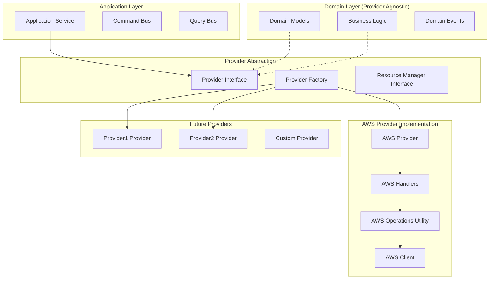
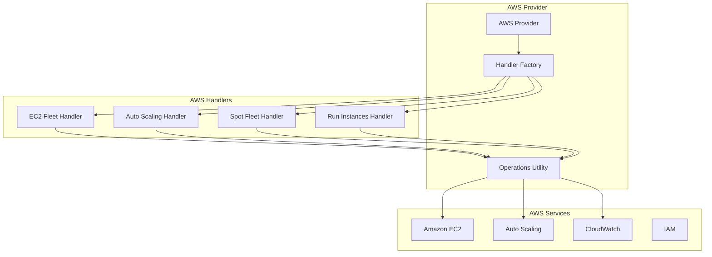

# Provider Architecture

The Open Resource Broker implements a sophisticated provider-agnostic architecture that enables seamless integration with multiple cloud providers while maintaining zero cloud dependencies in the core domain layer.

## Provider Architecture Overview



## Provider Abstraction Layer

### Provider Interface

The core provider interface defines the contract that all cloud providers must implement:

```python
from abc import ABC, abstractmethod
from typing import List, Dict, Any, Optional
from src.domain.machine import Machine
from src.domain.request import Request
from src.domain.template import Template

class ProviderInterface(ABC):
    """Abstract interface for cloud providers."""

    @abstractmethod
    def get_provider_type(self) -> str:
        """Get the provider type identifier."""
        pass

    @abstractmethod
    def initialize(self) -> bool:
        """Initialize the provider."""
        pass

    @abstractmethod
    def health_check(self) -> Dict[str, Any]:
        """Check provider health status."""
        pass

    @abstractmethod
    def get_available_templates(self) -> List[Template]:
        """Get available machine templates."""
        pass

    @abstractmethod
    def provision_machines(self, request: Request) -> List[Machine]:
        """Provision machines based on request."""
        pass

    @abstractmethod
    def terminate_machines(self, machine_ids: List[str]) -> bool:
        """Terminate specified machines."""
        pass

    @abstractmethod
    def get_machine_status(self, machine_ids: List[str]) -> List[Machine]:
        """Get status of specified machines."""
        pass

    @abstractmethod
    def validate_template(self, template: Template) -> List[str]:
        """Validate template configuration."""
        pass
```

### Provider Factory

The provider factory creates provider instances dynamically:

```python
from typing import Dict, Type, Optional
from src.infrastructure.logging.logger import get_logger

class ProviderFactory:
    """Factory for creating provider instances."""

    _providers: Dict[str, Type[ProviderInterface]] = {}

    @classmethod
    def register_provider(cls, provider_type: str, provider_class: Type[ProviderInterface]):
        """Register a provider implementation."""
        cls._providers[provider_type] = provider_class
        get_logger(__name__).info(f"Registered provider: {provider_type}")

    @classmethod
    def create_provider(cls, provider_type: str, config: Any) -> ProviderInterface:
        """Create a provider instance."""
        if provider_type not in cls._providers:
            raise ValueError(f"Unknown provider type: {provider_type}")

        provider_class = cls._providers[provider_type]
        return provider_class(config)

    @classmethod
    def get_available_providers(cls) -> List[str]:
        """Get list of available provider types."""
        return list(cls._providers.keys())

# Register AWS provider
from src.providers.aws.aws_provider import AWSProvider
ProviderFactory.register_provider("aws", AWSProvider)
```

## AWS Provider Implementation

### AWS Provider Architecture

The AWS provider implements a sophisticated handler-based architecture:



### AWS Provider Class

```python
from typing import List, Dict, Any, Optional
from src.infrastructure.interfaces.provider import ProviderInterface
from src.providers.aws.infrastructure.aws_handler_factory import AWSHandlerFactory
from src.providers.aws.configuration.config import AWSConfig
from src.providers.aws.utilities.aws_operations import AWSOperations

class AWSProvider(ProviderInterface):
    """AWS cloud provider implementation."""

    def __init__(self, config: AWSConfig):
        """Initialize AWS provider."""
        self.config = config
        self.handler_factory = AWSHandlerFactory(config)
        self.aws_operations = AWSOperations(config)
        self._initialized = False
        self.logger = get_logger(__name__)

    def get_provider_type(self) -> str:
        """Get provider type."""
        return "aws"

    def initialize(self) -> bool:
        """Initialize AWS provider."""
        try:
            # Test AWS connectivity
            self.aws_operations.test_connection()

            # Initialize handler factory
            self.handler_factory.initialize()

            self._initialized = True
            self.logger.info("AWS provider initialized successfully")
            return True

        except Exception as e:
            self.logger.error(f"Failed to initialize AWS provider: {e}")
            return False

    def health_check(self) -> Dict[str, Any]:
        """Check AWS provider health."""
        if not self._initialized:
            return {"status": "unhealthy", "reason": "not_initialized"}

        try:
            # Check AWS service connectivity
            ec2_health = self.aws_operations.check_ec2_connectivity()
            asg_health = self.aws_operations.check_autoscaling_connectivity()

            return {
                "status": "healthy" if ec2_health and asg_health else "degraded",
                "services": {
                    "ec2": "healthy" if ec2_health else "unhealthy",
                    "autoscaling": "healthy" if asg_health else "unhealthy"
                },
                "region": self.config.region,
                "account_id": self.aws_operations.get_account_id()
            }

        except Exception as e:
            return {"status": "unhealthy", "reason": str(e)}
```

### AWS Handler Hierarchy

#### Base Handler

```python
from abc import ABC, abstractmethod
from typing import List, Dict, Any
from src.providers.aws.utilities.aws_operations import AWSOperations

class BaseAWSHandler(ABC):
    """Base class for all AWS handlers."""

    def __init__(self, aws_operations: AWSOperations):
        """Initialize base handler."""
        self.aws_operations = aws_operations
        self.logger = get_logger(self.__class__.__name__)

    @abstractmethod
    def get_handler_type(self) -> str:
        """Get handler type identifier."""
        pass

    @abstractmethod
    def provision_machines(self, template: Dict[str, Any],
                          machine_count: int) -> List[Dict[str, Any]]:
        """Provision machines using this handler."""
        pass

    @abstractmethod
    def terminate_machines(self, machine_ids: List[str]) -> bool:
        """Terminate machines using this handler."""
        pass

    @abstractmethod
    def get_machine_status(self, machine_ids: List[str]) -> List[Dict[str, Any]]:
        """Get machine status using this handler."""
        pass

    def validate_template(self, template: Dict[str, Any]) -> List[str]:
        """Validate template for this handler."""
        errors = []

        # Common validation
        if not template.get('vm_type'):
            errors.append("vm_type is required")

        if not template.get('image_id'):
            errors.append("image_id is required")

        return errors
```

#### EC2 Fleet Handler

```python
class EC2FleetHandler(BaseAWSHandler):
    """Handler for EC2 Fleet operations."""

    def get_handler_type(self) -> str:
        return "EC2Fleet"

    def provision_machines(self, template: Dict[str, Any],
                          machine_count: int) -> List[Dict[str, Any]]:
        """Provision machines using EC2 Fleet."""
        try:
            # Create fleet configuration
            fleet_config = self._build_fleet_config(template, machine_count)

            # Create EC2 fleet
            fleet_response = self.aws_operations.create_ec2_fleet(fleet_config)

            # Wait for instances to be created
            instance_ids = self._wait_for_fleet_instances(fleet_response['FleetId'])

            # Get instance details
            machines = []
            for instance_id in instance_ids:
                instance_details = self.aws_operations.get_instance_details(instance_id)
                machines.append({
                    'machine_id': f"machine-{instance_id}",
                    'provider_instance_id': instance_id,
                    'status': 'PENDING',
                    'instance_type': instance_details.get('InstanceType'),
                    'private_ip': instance_details.get('PrivateIpAddress'),
                    'public_ip': instance_details.get('PublicIpAddress')
                })

            return machines

        except Exception as e:
            self.logger.error(f"Failed to provision machines with EC2 Fleet: {e}")
            raise

    def _build_fleet_config(self, template: Dict[str, Any],
                           machine_count: int) -> Dict[str, Any]:
        """Build EC2 Fleet configuration."""
        return {
            'LaunchTemplateConfigs': [{
                'LaunchTemplateSpecification': {
                    'LaunchTemplateName': template.get('launch_template_name'),
                    'Version': template.get('launch_template_version', '$Latest')
                },
                'Overrides': [{
                    'InstanceType': template['vm_type'],
                    'SubnetId': subnet_id,
                    'AvailabilityZone': self.aws_operations.get_subnet_az(subnet_id)
                } for subnet_id in template.get('subnet_ids', [])]
            }],
            'TargetCapacitySpecification': {
                'TotalTargetCapacity': machine_count,
                'OnDemandTargetCapacity': machine_count,
                'DefaultTargetCapacityType': 'on-demand'
            },
            'Type': 'instant'
        }
```

#### Auto Scaling Group Handler

```python
class ASGHandler(BaseAWSHandler):
    """Handler for Auto Scaling Group operations."""

    def get_handler_type(self) -> str:
        return "ASG"

    def provision_machines(self, template: Dict[str, Any],
                          machine_count: int) -> List[Dict[str, Any]]:
        """Provision machines using Auto Scaling Group."""
        try:
            # Create launch template if needed
            launch_template = self._ensure_launch_template(template)

            # Create Auto Scaling Group
            asg_name = f"hostfactory-{template['template_id']}-{int(time.time())}"
            asg_config = self._build_asg_config(template, machine_count,
                                              launch_template['LaunchTemplateName'])

            self.aws_operations.create_auto_scaling_group(asg_name, asg_config)

            # Wait for instances to be launched
            instance_ids = self._wait_for_asg_instances(asg_name, machine_count)

            # Get instance details
            machines = []
            for instance_id in instance_ids:
                instance_details = self.aws_operations.get_instance_details(instance_id)
                machines.append({
                    'machine_id': f"machine-{instance_id}",
                    'provider_instance_id': instance_id,
                    'status': 'PENDING',
                    'instance_type': instance_details.get('InstanceType'),
                    'private_ip': instance_details.get('PrivateIpAddress'),
                    'asg_name': asg_name
                })

            return machines

        except Exception as e:
            self.logger.error(f"Failed to provision machines with ASG: {e}")
            raise
```

### AWS Operations Utility

The AWS Operations utility consolidates common AWS operations:

```python
class AWSOperations:
    """Consolidated AWS operations utility."""

    def __init__(self, config: AWSConfig):
        """Initialize AWS operations."""
        self.config = config
        self.ec2_client = self._create_ec2_client()
        self.autoscaling_client = self._create_autoscaling_client()
        self.logger = get_logger(__name__)

    def create_ec2_fleet(self, fleet_config: Dict[str, Any]) -> Dict[str, Any]:
        """Create EC2 fleet with error handling and retry."""
        try:
            response = self.ec2_client.create_fleet(**fleet_config)

            if response.get('Errors'):
                error_msg = f"EC2 Fleet creation errors: {response['Errors']}"
                self.logger.error(error_msg)
                raise AWSProviderError(error_msg)

            return response

        except ClientError as e:
            error_code = e.response['Error']['Code']
            if error_code in ['InsufficientInstanceCapacity', 'RequestLimitExceeded']:
                # Retryable errors
                raise RetryableAWSError(f"AWS API error: {error_code}")
            else:
                # Non-retryable errors
                raise AWSProviderError(f"AWS API error: {error_code}")

    def terminate_instances(self, instance_ids: List[str]) -> bool:
        """Terminate EC2 instances with consolidated error handling."""
        try:
            if not instance_ids:
                return True

            response = self.ec2_client.terminate_instances(InstanceIds=instance_ids)

            # Check for termination errors
            terminating_instances = response.get('TerminatingInstances', [])
            failed_instances = [
                inst for inst in terminating_instances
                if inst.get('CurrentState', {}).get('Name') not in ['shutting-down', 'terminated']
            ]

            if failed_instances:
                self.logger.warning(f"Some instances failed to terminate: {failed_instances}")
                return False

            return True

        except ClientError as e:
            self.logger.error(f"Failed to terminate instances: {e}")
            return False

    def get_instance_details(self, instance_id: str) -> Dict[str, Any]:
        """Get detailed instance information."""
        try:
            response = self.ec2_client.describe_instances(InstanceIds=[instance_id])

            if not response['Reservations']:
                raise AWSProviderError(f"Instance {instance_id} not found")

            instance = response['Reservations'][0]['Instances'][0]
            return {
                'InstanceId': instance['InstanceId'],
                'InstanceType': instance['InstanceType'],
                'State': instance['State']['Name'],
                'PrivateIpAddress': instance.get('PrivateIpAddress'),
                'PublicIpAddress': instance.get('PublicIpAddress'),
                'LaunchTime': instance.get('LaunchTime'),
                'Tags': {tag['Key']: tag['Value'] for tag in instance.get('Tags', [])}
            }

        except ClientError as e:
            self.logger.error(f"Failed to get instance details: {e}")
            raise AWSProviderError(f"Failed to get instance details: {e}")
```

## Adding New Providers

### Implement Provider Interface

```python
# src/providers/provider1/azure_provider.py
from src.infrastructure.interfaces.provider import ProviderInterface

class AzureProvider(ProviderInterface):
    """Provider1 cloud provider implementation."""

    def __init__(self, config: AzureConfig):
        self.config = config
        # Initialize Provider1 clients

    def get_provider_type(self) -> str:
        return "provider1"

    def initialize(self) -> bool:
        # Initialize Provider1 provider
        pass

    # Implement all abstract methods...
```

### Create Provider Configuration

```python
# src/providers/provider1/configuration/config.py
from pydantic import BaseModel

class AzureConfig(BaseModel):
    """Provider1 provider configuration."""
    subscription_id: str
    tenant_id: str
    client_id: str
    client_secret: str
    resource_group: str
    location: str = "East US"
```

### Register Provider

```python
# Register Provider1 provider
from src.providers.provider1.azure_provider import AzureProvider
ProviderFactory.register_provider("provider1", AzureProvider)
```

### Update Configuration

```json
{
  "provider": {
    "type": "provider1",
    "provider1": {
      "subscription_id": "your-subscription-id",
      "tenant_id": "your-tenant-id",
      "client_id": "your-client-id",
      "client_secret": "${AZURE_CLIENT_SECRET}",
      "resource_group": "hostfactory-rg",
      "location": "East US"
    }
  }
}
```

## Provider Configuration

### AWS Provider Configuration

```json
{
  "provider": {
    "type": "aws",
    "aws": {
      "region": "us-east-1",
      "profile": "default",
      "handlers": {
        "preferred_order": ["EC2Fleet", "ASG", "SpotFleet", "RunInstances"],
        "ec2_fleet": {
          "enabled": true,
          "default_type": "instant",
          "max_spot_percentage": 50
        },
        "asg": {
          "enabled": true,
          "default_min_size": 0,
          "default_max_size": 100,
          "health_check_type": "EC2"
        },
        "spot_fleet": {
          "enabled": true,
          "allocation_strategy": "lowestPrice",
          "target_capacity": 10
        },
        "run_instances": {
          "enabled": true,
          "max_instances_per_call": 20
        }
      }
    }
  }
}
```

## Provider Best Practices

### Design Principles

1. **Provider Agnostic Domain**: Keep domain layer free of cloud-specific code
2. **Interface Segregation**: Define focused interfaces for specific capabilities
3. **Error Handling**: Implement comprehensive error handling and classification
4. **Retry Logic**: Handle transient errors with appropriate retry strategies
5. **Resource Cleanup**: Ensure appropriate cleanup of cloud resources

### Implementation Guidelines

1. **Use Factory Pattern**: Create providers through factory for flexibility
2. **Configuration Validation**: Validate provider configuration on startup
3. **Health Monitoring**: Implement health checks for provider connectivity
4. **Logging**: Add comprehensive logging for debugging and monitoring
5. **Testing**: Create mock providers for testing without cloud resources

### Performance Considerations

1. **Connection Pooling**: Reuse connections to cloud APIs
2. **Batch Operations**: Group similar operations for efficiency
3. **Caching**: Cache frequently accessed data (templates, metadata)
4. **Async Operations**: Use asynchronous operations where possible
5. **Rate Limiting**: Respect cloud provider rate limits

## Next Steps

- **[Resilience Patterns](resilience.md)**: Learn about error handling and retry logic
- **[Data Models](data_models.md)**: Understand the data validation architecture
- **[Storage Strategies](../user_guide/storage_strategies.md)**: Learn about storage options
- **[Configuration Reference](../configuration/native-spec-config.md)**: Complete configuration guide
