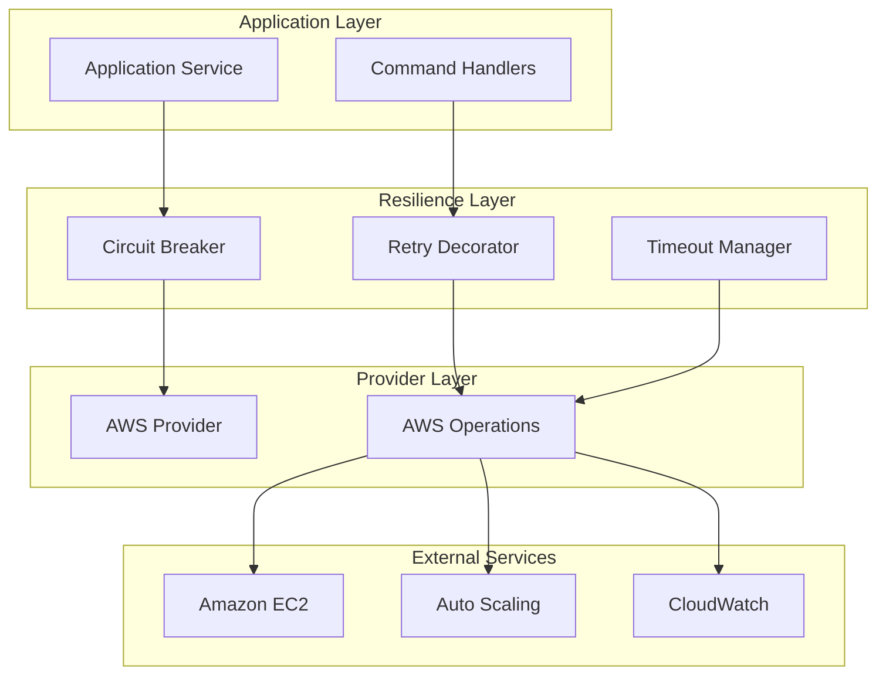
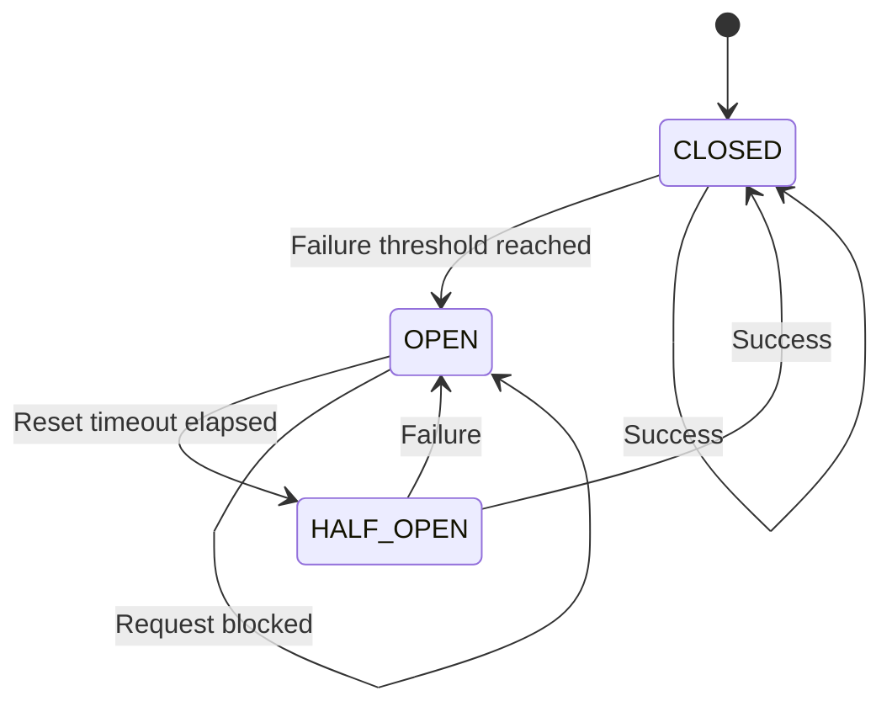

# Resilience and Reliability Patterns

The Open Host Factory Plugin implements sophisticated resilience patterns to handle failures gracefully and maintain system reliability in the face of transient errors, network issues, and cloud service disruptions.

## Resilience Architecture Overview



## Circuit Breaker Pattern

### Circuit Breaker States

The circuit breaker implements three states to prevent cascading failures:



### Circuit Breaker Implementation

```python
from enum import Enum
from typing import Optional, Dict, Any, Callable
import time
from src.infrastructure.resilience.exceptions import CircuitBreakerOpenError

class CircuitState(Enum):
    """Circuit breaker states."""
    CLOSED = "closed"      # Normal operation
    OPEN = "open"          # Failing fast
    HALF_OPEN = "half_open"  # Testing recovery

class CircuitBreakerStrategy:
    """Circuit breaker implementation for preventing cascading failures."""

    # Class-level storage for circuit states (shared across instances)
    _circuit_states: Dict[str, Dict[str, Any]] = {}

    def __init__(self, 
                 service_name: str,
                 failure_threshold: int = 5,
                 reset_timeout: int = 60,
                 half_open_timeout: int = 30):
        """
        Initialize circuit breaker.

        Args:
            service_name: Name of the service being protected
            failure_threshold: Number of failures before opening circuit
            reset_timeout: Seconds to wait before transitioning to half-open
            half_open_timeout: Seconds to wait in half-open before closing
        """
        self.service_name = service_name
        self.failure_threshold = failure_threshold
        self.reset_timeout = reset_timeout
        self.half_open_timeout = half_open_timeout

        # Initialize circuit state if not exists
        if service_name not in self._circuit_states:
            self._circuit_states[service_name] = {
                'state': CircuitState.CLOSED,
                'failure_count': 0,
                'last_failure_time': None,
                'last_success_time': None,
                'state_changed_time': time.time()
            }

    def call(self, func: Callable, *args, **kwargs) -> Any:
        """Execute function with circuit breaker protection."""
        state_info = self._circuit_states[self.service_name]
        current_state = state_info['state']

        # Check if circuit should transition states
        self._update_state()
        current_state = state_info['state']

        if current_state == CircuitState.OPEN:
            raise CircuitBreakerOpenError(
                f"Circuit breaker is OPEN for service: {self.service_name}"
            )

        try:
            # Execute the function
            result = func(*args, **kwargs)

            # Record success
            self._record_success()

            return result

        except Exception as e:
            # Record failure
            self._record_failure()
            raise

    def _update_state(self) -> None:
        """Update circuit breaker state based on current conditions."""
        state_info = self._circuit_states[self.service_name]
        current_state = state_info['state']
        current_time = time.time()

        if current_state == CircuitState.OPEN:
            # Check if reset timeout has elapsed
            if (state_info['last_failure_time'] and 
                current_time - state_info['last_failure_time'] >= self.reset_timeout):
                self._transition_to_half_open()

        elif current_state == CircuitState.HALF_OPEN:
            # Check if half-open timeout has elapsed without success
            if (current_time - state_info['state_changed_time'] >= self.half_open_timeout):
                self._transition_to_open()

    def _record_success(self) -> None:
        """Record successful operation."""
        state_info = self._circuit_states[self.service_name]
        state_info['failure_count'] = 0
        state_info['last_success_time'] = time.time()

        if state_info['state'] == CircuitState.HALF_OPEN:
            self._transition_to_closed()

    def _record_failure(self) -> None:
        """Record failed operation."""
        state_info = self._circuit_states[self.service_name]
        state_info['failure_count'] += 1
        state_info['last_failure_time'] = time.time()

        if (state_info['state'] == CircuitState.CLOSED and 
            state_info['failure_count'] >= self.failure_threshold):
            self._transition_to_open()
        elif state_info['state'] == CircuitState.HALF_OPEN:
            self._transition_to_open()

    def _transition_to_open(self) -> None:
        """Transition circuit to OPEN state."""
        state_info = self._circuit_states[self.service_name]
        state_info['state'] = CircuitState.OPEN
        state_info['state_changed_time'] = time.time()

        logger.warning(f"Circuit breaker OPENED for service: {self.service_name}")

    def _transition_to_half_open(self) -> None:
        """Transition circuit to HALF_OPEN state."""
        state_info = self._circuit_states[self.service_name]
        state_info['state'] = CircuitState.HALF_OPEN
        state_info['state_changed_time'] = time.time()

        logger.info(f"Circuit breaker HALF_OPEN for service: {self.service_name}")

    def _transition_to_closed(self) -> None:
        """Transition circuit to CLOSED state."""
        state_info = self._circuit_states[self.service_name]
        state_info['state'] = CircuitState.CLOSED
        state_info['state_changed_time'] = time.time()
        state_info['failure_count'] = 0

        logger.info(f"Circuit breaker CLOSED for service: {self.service_name}")
```

### Circuit Breaker Usage

```python
# Protect AWS EC2 operations
ec2_circuit_breaker = CircuitBreakerStrategy(
    service_name="aws_ec2",
    failure_threshold=3,
    reset_timeout=30
)

def provision_ec2_instances(template, count):
    """Provision EC2 instances with circuit breaker protection."""
    return ec2_circuit_breaker.call(
        aws_operations.run_instances,
        template=template,
        count=count
    )

# Protect Auto Scaling operations
asg_circuit_breaker = CircuitBreakerStrategy(
    service_name="aws_autoscaling",
    failure_threshold=5,
    reset_timeout=60
)

def create_auto_scaling_group(config):
    """Create ASG with circuit breaker protection."""
    return asg_circuit_breaker.call(
        aws_operations.create_auto_scaling_group,
        config=config
    )
```

## Retry Strategies

### Exponential Backoff Strategy

```python
import random
import time
from typing import List, Type, Callable, Any

class ExponentialBackoffStrategy:
    """Exponential backoff retry strategy with jitter."""

    def __init__(self,
                 max_attempts: int = 3,
                 base_delay: float = 1.0,
                 max_delay: float = 60.0,
                 exponential_base: float = 2.0,
                 jitter: bool = True,
                 retryable_exceptions: List[Type[Exception]] = None):
        """
        Initialize exponential backoff strategy.

        Args:
            max_attempts: Maximum number of retry attempts
            base_delay: Base delay in seconds
            max_delay: Maximum delay in seconds
            exponential_base: Base for exponential calculation
            jitter: Whether to add random jitter
            retryable_exceptions: List of exceptions that should trigger retry
        """
        self.max_attempts = max_attempts
        self.base_delay = base_delay
        self.max_delay = max_delay
        self.exponential_base = exponential_base
        self.jitter = jitter
        self.retryable_exceptions = retryable_exceptions or []

    def execute(self, func: Callable, *args, **kwargs) -> Any:
        """Execute function with exponential backoff retry."""
        last_exception = None

        for attempt in range(self.max_attempts):
            try:
                return func(*args, **kwargs)

            except Exception as e:
                last_exception = e

                # Check if exception is retryable
                if not self._is_retryable_exception(e):
                    raise

                # Don't sleep on the last attempt
                if attempt < self.max_attempts - 1:
                    delay = self._calculate_delay(attempt)
                    time.sleep(delay)

        # All attempts failed, raise the last exception
        raise last_exception

    def _is_retryable_exception(self, exception: Exception) -> bool:
        """Check if exception should trigger a retry."""
        if not self.retryable_exceptions:
            return True  # Retry all exceptions if none specified

        return any(isinstance(exception, exc_type) 
                  for exc_type in self.retryable_exceptions)

    def _calculate_delay(self, attempt: int) -> float:
        """Calculate delay for the given attempt."""
        # Calculate exponential delay
        delay = self.base_delay * (self.exponential_base ** attempt)

        # Apply maximum delay limit
        delay = min(delay, self.max_delay)

        # Add jitter if enabled
        if self.jitter:
            # Add random jitter up to 10% of the delay
            jitter_amount = delay * 0.1 * random.random()
            delay += jitter_amount

        return delay
```

### AWS-Specific Retry Strategy

```python
from botocore.exceptions import ClientError, BotoCoreError

class AWSRetryStrategy(ExponentialBackoffStrategy):
    """AWS-specific retry strategy with error classification."""

    def __init__(self, **kwargs):
        # AWS-specific retryable exceptions
        retryable_exceptions = [
            ClientError,
            BotoCoreError,
            ConnectionError,
            TimeoutError
        ]

        super().__init__(retryable_exceptions=retryable_exceptions, **kwargs)

    def _is_retryable_exception(self, exception: Exception) -> bool:
        """Check if AWS exception should trigger a retry."""
        if isinstance(exception, ClientError):
            error_code = exception.response['Error']['Code']

            # Retryable AWS error codes
            retryable_codes = [
                'ThrottlingException',
                'RequestLimitExceeded',
                'ServiceUnavailable',
                'InternalServerError',
                'InternalError',
                'RequestTimeout',
                'RequestTimeoutException',
                'PriorRequestNotComplete',
                'ConnectionError',
                'RequestTimeTooSkewed'
            ]

            return error_code in retryable_codes

        return super()._is_retryable_exception(exception)
```

### Retry Decorator

```python
from functools import wraps
from typing import Callable, Any

def retry_with_backoff(max_attempts: int = 3,
                      base_delay: float = 1.0,
                      max_delay: float = 60.0,
                      exponential_base: float = 2.0,
                      jitter: bool = True):
    """Decorator for adding retry logic with exponential backoff."""

    def decorator(func: Callable) -> Callable:
        @wraps(func)
        def wrapper(*args, **kwargs) -> Any:
            retry_strategy = ExponentialBackoffStrategy(
                max_attempts=max_attempts,
                base_delay=base_delay,
                max_delay=max_delay,
                exponential_base=exponential_base,
                jitter=jitter
            )

            return retry_strategy.execute(func, *args, **kwargs)

        return wrapper

    return decorator

# Usage example
@retry_with_backoff(max_attempts=3, base_delay=2.0)
def create_ec2_instances(template, count):
    """Create EC2 instances with automatic retry."""
    return ec2_client.run_instances(
        ImageId=template['image_id'],
        MinCount=count,
        MaxCount=count,
        InstanceType=template['instance_type']
    )
```

## Error Classification and Handling

### Error Hierarchy

```python
class ResilienceError(Exception):
    """Base exception for resilience-related errors."""
    pass

class RetryableError(ResilienceError):
    """Exception that should trigger retry logic."""
    pass

class NonRetryableError(ResilienceError):
    """Exception that should not trigger retry logic."""
    pass

class CircuitBreakerOpenError(ResilienceError):
    """Exception raised when circuit breaker is open."""
    pass

class TimeoutError(RetryableError):
    """Exception raised when operation times out."""
    pass

class RateLimitError(RetryableError):
    """Exception raised when rate limit is exceeded."""
    pass

class AuthenticationError(NonRetryableError):
    """Exception raised for authentication failures."""
    pass

class AuthorizationError(NonRetryableError):
    """Exception raised for authorization failures."""
    pass
```

### Error Classification

```python
from src.domain.base.exceptions import DomainException
from botocore.exceptions import ClientError

class ErrorClassifier:
    """Classifies errors for appropriate handling."""

    @staticmethod
    def classify_aws_error(exception: ClientError) -> str:
        """Classify AWS ClientError for handling strategy."""
        error_code = exception.response['Error']['Code']

        # Retryable errors
        retryable_codes = {
            'ThrottlingException': 'rate_limit',
            'RequestLimitExceeded': 'rate_limit',
            'ServiceUnavailable': 'service_unavailable',
            'InternalServerError': 'internal_error',
            'RequestTimeout': 'timeout',
            'InsufficientInstanceCapacity': 'capacity_issue'
        }

        # Non-retryable errors
        non_retryable_codes = {
            'InvalidUserID.NotFound': 'authentication',
            'UnauthorizedOperation': 'authorization',
            'InvalidParameterValue': 'validation',
            'InvalidAMIID.NotFound': 'validation',
            'InvalidSubnetID.NotFound': 'validation'
        }

        if error_code in retryable_codes:
            return f"retryable_{retryable_codes[error_code]}"
        elif error_code in non_retryable_codes:
            return f"non_retryable_{non_retryable_codes[error_code]}"
        else:
            return "unknown"

    @staticmethod
    def should_retry(exception: Exception) -> bool:
        """Determine if exception should trigger retry."""
        if isinstance(exception, NonRetryableError):
            return False

        if isinstance(exception, RetryableError):
            return True

        if isinstance(exception, DomainException):
            return False  # Domain exceptions are typically not retryable

        if isinstance(exception, ClientError):
            classification = ErrorClassifier.classify_aws_error(exception)
            return classification.startswith("retryable_")

        # Default to retryable for unknown exceptions
        return True
```

## Timeout Management

### Timeout Configuration

```python
from typing import Dict, Optional
import asyncio
import signal

class TimeoutManager:
    """Manages operation timeouts."""

    def __init__(self, default_timeout: int = 30):
        """Initialize timeout manager."""
        self.default_timeout = default_timeout
        self.operation_timeouts: Dict[str, int] = {}

    def set_operation_timeout(self, operation: str, timeout: int) -> None:
        """Set timeout for specific operation."""
        self.operation_timeouts[operation] = timeout

    def get_operation_timeout(self, operation: str) -> int:
        """Get timeout for specific operation."""
        return self.operation_timeouts.get(operation, self.default_timeout)

    def execute_with_timeout(self, func: Callable, operation: str, 
                           *args, **kwargs) -> Any:
        """Execute function with timeout."""
        timeout = self.get_operation_timeout(operation)

        def timeout_handler(signum, frame):
            raise TimeoutError(f"Operation {operation} timed out after {timeout} seconds")

        # Set up timeout signal
        old_handler = signal.signal(signal.SIGALRM, timeout_handler)
        signal.alarm(timeout)

        try:
            result = func(*args, **kwargs)
            return result
        finally:
            # Clean up timeout
            signal.alarm(0)
            signal.signal(signal.SIGALRM, old_handler)

# Configure operation-specific timeouts
timeout_manager = TimeoutManager(default_timeout=30)
timeout_manager.set_operation_timeout("ec2_run_instances", 180)
timeout_manager.set_operation_timeout("ec2_terminate_instances", 60)
timeout_manager.set_operation_timeout("autoscaling_create_group", 120)
timeout_manager.set_operation_timeout("spot_fleet_request", 300)
```

### Async Timeout Support

```python
import asyncio
from typing import Awaitable, TypeVar

T = TypeVar('T')

async def execute_with_async_timeout(coro: Awaitable[T], 
                                   timeout: float) -> T:
    """Execute coroutine with timeout."""
    try:
        return await asyncio.wait_for(coro, timeout=timeout)
    except asyncio.TimeoutError:
        raise TimeoutError(f"Async operation timed out after {timeout} seconds")
```

## Resilience Configuration

### Complete Resilience Configuration

```json
{
  "resilience": {
    "circuit_breaker": {
      "enabled": true,
      "default_failure_threshold": 5,
      "default_reset_timeout": 60,
      "default_half_open_timeout": 30,
      "services": {
        "aws_ec2": {
          "failure_threshold": 3,
          "reset_timeout": 30,
          "half_open_timeout": 15
        },
        "aws_autoscaling": {
          "failure_threshold": 5,
          "reset_timeout": 60,
          "half_open_timeout": 30
        },
        "aws_spot_fleet": {
          "failure_threshold": 3,
          "reset_timeout": 45,
          "half_open_timeout": 20
        }
      }
    },
    "retry": {
      "enabled": true,
      "default_max_attempts": 3,
      "default_base_delay": 1.0,
      "default_max_delay": 60.0,
      "default_exponential_base": 2.0,
      "default_jitter": true,
      "operations": {
        "ec2_run_instances": {
          "max_attempts": 5,
          "base_delay": 2.0,
          "max_delay": 120.0
        },
        "autoscaling_create_group": {
          "max_attempts": 3,
          "base_delay": 5.0,
          "max_delay": 180.0
        },
        "spot_fleet_request": {
          "max_attempts": 4,
          "base_delay": 3.0,
          "max_delay": 240.0
        }
      }
    },
    "timeout": {
      "default_timeout": 30,
      "operations": {
        "ec2_run_instances": 180,
        "ec2_terminate_instances": 60,
        "ec2_describe_instances": 30,
        "autoscaling_create_group": 120,
        "autoscaling_delete_group": 180,
        "spot_fleet_request": 300,
        "spot_fleet_cancel": 120
      }
    },
    "error_handling": {
      "log_retries": true,
      "log_circuit_breaker_state_changes": true,
      "alert_on_circuit_breaker_open": true,
      "max_consecutive_failures_before_alert": 10
    }
  }
}
```

## Resilience Patterns in Practice

### AWS Provider with Resilience

```python
class ResilientAWSProvider(AWSProvider):
    """AWS provider with built-in resilience patterns."""

    def __init__(self, config: AWSConfig, resilience_config: Dict[str, Any]):
        super().__init__(config)
        self.resilience_config = resilience_config
        self._setup_resilience()

    def _setup_resilience(self) -> None:
        """Set up resilience patterns."""
        # Circuit breakers for different services
        self.ec2_circuit_breaker = CircuitBreakerStrategy(
            service_name="aws_ec2",
            **self.resilience_config['circuit_breaker']['services']['aws_ec2']
        )

        self.asg_circuit_breaker = CircuitBreakerStrategy(
            service_name="aws_autoscaling",
            **self.resilience_config['circuit_breaker']['services']['aws_autoscaling']
        )

        # Retry strategies
        self.retry_strategy = AWSRetryStrategy(
            **self.resilience_config['retry']
        )

        # Timeout manager
        self.timeout_manager = TimeoutManager(
            default_timeout=self.resilience_config['timeout']['default_timeout']
        )

        # Set operation timeouts
        for operation, timeout in self.resilience_config['timeout']['operations'].items():
            self.timeout_manager.set_operation_timeout(operation, timeout)

    def provision_machines(self, request: Request) -> List[Machine]:
        """Provision machines with full resilience protection."""
        def _provision():
            return super().provision_machines(request)

        # Apply circuit breaker
        def _with_circuit_breaker():
            return self.ec2_circuit_breaker.call(_provision)

        # Apply retry logic
        def _with_retry():
            return self.retry_strategy.execute(_with_circuit_breaker)

        # Apply timeout
        return self.timeout_manager.execute_with_timeout(
            _with_retry, 
            "ec2_run_instances"
        )
```

### Monitoring Resilience Patterns

```python
class ResilienceMonitor:
    """Monitor resilience pattern effectiveness."""

    def __init__(self):
        self.metrics = {
            'circuit_breaker_opens': 0,
            'circuit_breaker_closes': 0,
            'retry_attempts': 0,
            'retry_successes': 0,
            'timeout_errors': 0,
            'total_operations': 0,
            'successful_operations': 0
        }

    def record_circuit_breaker_open(self, service_name: str) -> None:
        """Record circuit breaker opening."""
        self.metrics['circuit_breaker_opens'] += 1
        logger.warning(f"Circuit breaker opened for {service_name}")

    def record_retry_attempt(self, operation: str, attempt: int) -> None:
        """Record retry attempt."""
        self.metrics['retry_attempts'] += 1
        logger.debug(f"Retry attempt {attempt} for {operation}")

    def record_operation_success(self, operation: str) -> None:
        """Record successful operation."""
        self.metrics['successful_operations'] += 1
        self.metrics['total_operations'] += 1

    def record_operation_failure(self, operation: str, error: str) -> None:
        """Record failed operation."""
        self.metrics['total_operations'] += 1
        logger.error(f"Operation {operation} failed: {error}")

    def get_success_rate(self) -> float:
        """Calculate operation success rate."""
        if self.metrics['total_operations'] == 0:
            return 0.0

        return self.metrics['successful_operations'] / self.metrics['total_operations']

    def get_metrics_summary(self) -> Dict[str, Any]:
        """Get resilience metrics summary."""
        return {
            'success_rate': self.get_success_rate(),
            'circuit_breaker_opens': self.metrics['circuit_breaker_opens'],
            'retry_attempts': self.metrics['retry_attempts'],
            'timeout_errors': self.metrics['timeout_errors'],
            'total_operations': self.metrics['total_operations']
        }
```

## Best Practices

### Circuit Breaker Best Practices

1. **Service-Specific Configuration**: Configure different thresholds for different services
2. **Monitoring**: Monitor circuit breaker state changes and alert on opens
3. **Graceful Degradation**: Provide fallback behavior when circuit is open
4. **Testing**: Test circuit breaker behavior under failure conditions

### Retry Best Practices

1. **Exponential Backoff**: Use exponential backoff with jitter to avoid thundering herd
2. **Error Classification**: Only retry transient errors, not permanent failures
3. **Maximum Attempts**: Set reasonable maximum retry attempts to avoid infinite loops
4. **Timeout Integration**: Combine retries with timeouts for complete protection

### Timeout Best Practices

1. **Operation-Specific**: Set different timeouts for different operations
2. **Realistic Values**: Set timeouts based on actual operation characteristics
3. **Cascading Timeouts**: Ensure timeouts cascade properly through call chains
4. **Monitoring**: Monitor timeout occurrences to tune timeout values

## Troubleshooting Resilience

### Common Issues

#### Circuit Breaker Not Opening
```bash
# Check failure threshold configuration
grep -A 10 "circuit_breaker" config/config.json

# Monitor failure counts
tail -f logs/app.log | grep "circuit.*failure"
```

#### Excessive Retries
```bash
# Check retry configuration
grep -A 10 "retry" config/config.json

# Monitor retry attempts
tail -f logs/app.log | grep "retry.*attempt"
```

#### Timeout Issues
```bash
# Check timeout configuration
grep -A 10 "timeout" config/config.json

# Monitor timeout errors
tail -f logs/app.log | grep "timeout"
```

## Next Steps

- **[Data Models](data_models.md)**: Learn about data validation and models
- **[Dependency Injection](dependency_injection.md)**: Understand the DI architecture
- **[Provider Architecture](providers.md)**: Learn about provider implementation
- **[Configuration Reference](../configuration/native-spec-config.md)**: Complete configuration options
