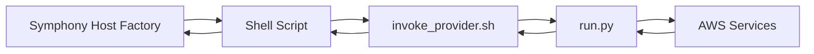

# API Reference

The Open Host Factory Plugin provides a command-line interface that integrates with IBM Spectrum Symphony Host Factory. This reference covers all available commands and their usage.

## Command Line Interface

### Basic Usage

```bash
# Direct Python execution
python run.py <command> [options]

# Via shell scripts (Symphony integration)
./scripts/<command>.sh [input]
```

### Input Methods

The application supports multiple input methods:

1. **Command line arguments** (for simple commands)
2. **JSON data via --data flag**
3. **JSON file via --file flag**
4. **Standard input** (when using shell scripts)

### Global Options

| Option | Description | Example |
|--------|-------------|---------|
| `--data` | JSON string input | `--data '{"template_id": "test"}'` |
| `--file` | Path to JSON file | `--file input.json` |
| `--all` | Apply to all items | `--all` |
| `--long` | Include detailed information | `--long` |
| `--clean` | Clean up resources | `--clean` |
| `--config` | Configuration file path | `--config config/prod.json` |
| `--log-level` | Logging level | `--log-level DEBUG` |

## Available Commands

### getAvailableTemplates

Get list of available VM templates.

#### Usage
```bash
# Basic usage
python run.py getAvailableTemplates

# Via shell script
./scripts/getAvailableTemplates.sh

# With filter
python run.py getAvailableTemplates --provider-api RunInstances
```

#### Input Format
```json
{
  "provider_api": "RunInstances|SpotFleet|EC2Fleet|ASG"
}
```

#### Output Format
```json
{
  "templates": [
    {
      "template_id": "SymphonyOnDemand",
      "provider_api": "RunInstances",
      "max_number": 5,
      "attributes": {
        "type": ["String", "X86_64"],
        "ncores": ["Numeric", "2"],
        "ncpus": ["Numeric", "1"],
        "nram": ["Numeric", "4096"]
      },
      "vm_type": "t2.micro",
      "image_id": "/aws/service/ami-amazon-linux-latest/al2023-ami-kernel-6.1-x86_64"
    }
  ]
}
```

### requestMachines

Request new virtual machines based on a template.

#### Usage
```bash
# With command line arguments (optional)
python run.py requestMachines [template_id] [machine_count]

# With JSON data
python run.py requestMachines --data '{"template_id": "test", "machine_count": 3}'

# With JSON file
python run.py requestMachines --file request.json

# Via shell script
echo '{"template_id": "test", "machine_count": 3}' | ./scripts/requestMachines.sh
```

#### Input Format
```json
{
  "template_id": "SymphonyOnDemand",
  "machine_count": 3,
  "tags": {
    "Environment": "test",
    "Project": "symphony"
  },
  "priority": 5
}
```

#### Output Format
```json
{
  "request_id": "req-12345678-1234-1234-1234-123456789012",
  "template_id": "SymphonyOnDemand",
  "machine_count": 3,
  "status": "PENDING",
  "created_at": "2025-06-30T12:00:00Z",
  "machines": []
}
```

### getRequestStatus

Get the status of a machine request.

#### Usage
```bash
# With request ID
python run.py getRequestStatus --request-id req-12345678-1234-1234-1234-123456789012

# With JSON data
python run.py getRequestStatus --data '{"request_id": "req-123..."}'

# Via shell script
echo '{"request_id": "req-123..."}' | ./scripts/getRequestStatus.sh
```

#### Input Format
```json
{
  "request_id": "req-12345678-1234-1234-1234-123456789012"
}
```

#### Output Format
```json
{
  "request_id": "req-12345678-1234-1234-1234-123456789012",
  "template_id": "SymphonyOnDemand",
  "machine_count": 3,
  "status": "COMPLETED",
  "created_at": "2025-06-30T12:00:00Z",
  "updated_at": "2025-06-30T12:05:00Z",
  "completed_at": "2025-06-30T12:05:00Z",
  "machines": [
    {
      "machine_id": "machine-i-1234567890abcdef0",
      "name": "symphony-instance-1",
      "status": "RUNNING",
      "instance_type": "t2.micro",
      "private_ip": "10.0.1.100",
      "public_ip": null,
      "provider_instance_id": "i-1234567890abcdef0"
    }
  ]
}
```

### getReturnRequests

Get list of return requests (machines to be terminated).

#### Usage
```bash
# Get all return requests
python run.py getReturnRequests

# Get active requests only
python run.py getReturnRequests --active-only

# Get return requests only
python run.py getReturnRequests --return-only

# Via shell script
./scripts/getReturnRequests.sh
```

#### Input Format
```json
{
  "active_only": true,
  "return_only": true
}
```

#### Output Format
```json
{
  "return_requests": [
    {
      "request_id": "ret-12345678-1234-1234-1234-123456789012",
      "machine_ids": ["machine-i-1234567890abcdef0"],
      "status": "PENDING",
      "created_at": "2025-06-30T12:00:00Z"
    }
  ]
}
```

### requestReturnMachines

Request machines to be returned (terminated).

#### Usage Methods

**Primary Method - Positional Arguments:**
```bash
# Machine IDs as command line arguments (recommended for simple cases)
python run.py requestReturnMachines machine-id-1 machine-id-2 machine-id-3
```

**Alternative Method - JSON Data:**
```bash
# JSON data via --data flag (recommended for complex cases or scripting)
python run.py requestReturnMachines --data '{"machine_ids": ["machine-id-1", "machine-id-2"]}'

# JSON data via file (recommended for large lists)
echo '{"machine_ids": ["machine-id-1", "machine-id-2"]}' > return_request.json
python run.py requestReturnMachines --file return_request.json
```

**Symphony Integration Method:**
```bash
# Via shell script (used by Symphony Host Factory)
echo '{"machine_ids": ["machine-id-1"]}' | ./scripts/requestReturnMachines.sh
```

#### When to Use Each Method

- **Positional Arguments**: Best for simple cases with few machine IDs
- **JSON Data**: Best for scripting, automation, or large lists of machines
- **Shell Scripts**: Used by Symphony Host Factory integration

#### Input Format
```json
{
  "machine_ids": [
    "machine-i-1234567890abcdef0",
    "machine-i-0987654321fedcba0"
  ]
}
```

#### Output Format
```json
{
  "request_id": "ret-12345678-1234-1234-1234-123456789012",
  "machine_ids": [
    "machine-i-1234567890abcdef0",
    "machine-i-0987654321fedcba0"
  ],
  "status": "PENDING",
  "created_at": "2025-06-30T12:00:00Z"
}
```

### migrateRepository

Migrate data between storage strategies.

#### Usage
```bash
# Basic migration
python run.py migrateRepository --source-type json --target-type sqlite

# With options
python run.py migrateRepository \
  --source-type json \
  --target-type sqlite \
  --batch-size 100 \
  --create-backup \
  --validate-after
```

#### Options
| Option | Description | Default |
|--------|-------------|---------|
| `--source-type` | Source storage type (json, sqlite, dynamodb) | Required |
| `--target-type` | Target storage type (json, sqlite, dynamodb) | Required |
| `--batch-size` | Records per batch | 100 |
| `--create-backup` | Create backup before migration | true |
| `--validate-after` | Validate after migration | true |
| `--cleanup-source` | Remove source data after migration | false |

#### Output Format
```json
{
  "migration_id": "migration-12345678",
  "source_type": "json",
  "target_type": "sqlite",
  "status": "COMPLETED",
  "records_migrated": 1500,
  "duration_seconds": 45.2,
  "backup_created": "/path/to/backup.json"
}
```

## Shell Script Integration

### Symphony Integration Flow



### Shell Script Usage

#### Input via Standard Input
```bash
# Symphony passes JSON data via stdin
echo '{"template_id": "test", "machine_count": 2}' | ./scripts/requestMachines.sh
```

#### Environment Variables
```bash
# Set Host Factory environment variables
export HF_PROVIDER_CONFDIR=/etc/hostfactory
export HF_PROVIDER_WORKDIR=/var/lib/hostfactory
export HF_PROVIDER_LOGDIR=/var/log/hostfactory

# Execute script
./scripts/getAvailableTemplates.sh
```

### Available Shell Scripts

| Script | Purpose | Symphony Command |
|--------|---------|------------------|
| `getAvailableTemplates.sh` | Get available templates | `getAvailableTemplates` |
| `requestMachines.sh` | Request new machines | `requestMachines` |
| `getRequestStatus.sh` | Check request status | `getRequestStatus` |
| `getReturnRequests.sh` | Get return requests | `getReturnRequests` |
| `requestReturnMachines.sh` | Return machines | `requestReturnMachines` |

## Error Handling

### Error Response Format

```json
{
  "error": "Template not found",
  "error_code": "TEMPLATE_NOT_FOUND",
  "timestamp": "2025-06-30T12:00:00Z",
  "request_id": "req-12345678-1234-1234-1234-123456789012",
  "details": {
    "template_id": "invalid-template"
  }
}
```

### Common Error Codes

| Error Code | Description | Resolution |
|------------|-------------|------------|
| `TEMPLATE_NOT_FOUND` | Template doesn't exist | Check template ID and configuration |
| `INVALID_REQUEST` | Invalid request format | Validate JSON input format |
| `PROVIDER_ERROR` | Cloud provider error | Check AWS credentials and permissions |
| `CONFIGURATION_ERROR` | Configuration issue | Validate configuration file |
| `RESOURCE_LIMIT_EXCEEDED` | Resource limits exceeded | Check template max_number setting |

### Exit Codes

| Exit Code | Description |
|-----------|-------------|
| 0 | Success |
| 1 | General error |
| 2 | Configuration error |
| 3 | Provider error |
| 4 | Validation error |

## Examples

### Complete Request Flow

```bash
# 1. Get available templates
python run.py getAvailableTemplates

# 2. Request machines
python run.py requestMachines --data '{
  "template_id": "SymphonyOnDemand",
  "machine_count": 2
}'

# 3. Check request status
python run.py getRequestStatus --request-id req-12345678-1234-1234-1234-123456789012

# 4. Return machines when done
python run.py requestReturnMachines --data '{
  "machine_ids": ["machine-i-1234567890abcdef0"]
}'
```

### Symphony Integration Example

```bash
# Symphony calls shell scripts with JSON input
echo '{
  "template_id": "SymphonyOnDemand",
  "machine_count": 3,
  "tags": {
    "Environment": "production",
    "Project": "symphony"
  }
}' | ./scripts/requestMachines.sh
```

### Batch Operations

```bash
# Process multiple requests
for template in template1 template2 template3; do
  echo "{\"template_id\": \"$template\", \"machine_count\": 1}" | \
    python run.py requestMachines --data '{}'
done
```

## Next Steps

- **[Templates](templates.md)**: Learn about template configuration
- **[Requests](requests.md)**: Understand request management
- **[Configuration](configuration.md)**: Configure the application
- **[Deployment](deployment.md)**: Deploy in production environments
