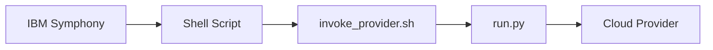

# Installation Guide

This guide covers the installation and setup of the Open Host Factory Plugin for IBM Spectrum Symphony integration with cloud providers.

## Overview

The Open Host Factory Plugin is a command-line tool that integrates with IBM Spectrum Symphony Host Factory through shell scripts. Symphony calls the shell scripts, which in turn execute the Python application.

## Prerequisites

### System Requirements

- **Python**: 3.8 or higher
- **Operating System**: Linux, macOS, or Windows
- **Memory**: Minimum 512MB RAM
- **Disk Space**: 100MB for application and dependencies
- **Network**: Internet access for cloud provider APIs

### Cloud Provider Requirements

#### AWS Requirements
- AWS CLI configured or IAM role with appropriate permissions
- Access to EC2, Auto Scaling, and optionally DynamoDB services
- VPC with subnets and security groups configured

## Installation Methods

### Method 1: Git Clone (Recommended)

```bash
# Clone the repository
git clone https://github.com/your-org/open-hostfactory-plugin.git
cd open-hostfactory-plugin

# Create virtual environment
python -m venv .venv
source .venv/bin/activate  # On Windows: .venv\Scripts\activate

# Install dependencies
pip install -r requirements.txt

# Verify critical dependencies are installed
python -c "import pydantic, boto3; print('Core dependencies installed successfully')"

# For development (optional)
pip install -r requirements-dev.txt

# Verify installation
python run.py getAvailableTemplates --help
```

### Method 2: Direct Download

```bash
# Download and extract
wget https://github.com/your-org/open-hostfactory-plugin/archive/main.zip
unzip main.zip
cd open-hostfactory-plugin-main

# Follow same steps as Method 1
python -m venv .venv
source .venv/bin/activate
pip install -r requirements.txt
```

## Symphony Integration Setup

### Shell Script Integration

IBM Spectrum Symphony Host Factory calls the shell scripts in the `scripts/` directory:

```bash
# Available shell scripts for Symphony integration:
scripts/
+--- getAvailableTemplates.sh    # Get available VM templates
+--- requestMachines.sh          # Request new machines
+--- getRequestStatus.sh         # Check request status
+--- getReturnRequests.sh        # Get return requests
+--- requestReturnMachines.sh    # Return machines
+--- invoke_provider.sh          # Main wrapper script
```

### Script Execution Flow



### Symphony Configuration

Configure Symphony Host Factory to call the shell scripts:

```bash
# Example Symphony configuration (adjust paths for your installation)
PROVIDER_SCRIPT_DIR=/path/to/open-hostfactory-plugin/scripts

# Symphony will call:
# $PROVIDER_SCRIPT_DIR/getAvailableTemplates.sh
# $PROVIDER_SCRIPT_DIR/requestMachines.sh
# $PROVIDER_SCRIPT_DIR/getRequestStatus.sh
# etc.
```

### Environment Variables for Symphony

Set these environment variables for Symphony integration:

```bash
# Required Host Factory environment variables
export HF_PROVIDER_WORKDIR=/var/lib/hostfactory
export HF_PROVIDER_LOGDIR=/var/log/hostfactory
export HF_PROVIDER_CONFDIR=/etc/hostfactory

# Optional environment variables
export HF_PROVIDER_EVENTSDIR=/var/lib/hostfactory/events
export HF_PROVIDER_SNAPSHOTSDIR=/var/lib/hostfactory/snapshots
export HF_PROVIDER_NAME=aws-production
```

## Configuration Setup

### Basic Configuration

Create the main configuration file:

```bash
# Create configuration directory
mkdir -p config

# Create basic configuration
cat > config/config.json << 'EOF'
{
  "version": "2.0.0",
  "provider": {
    "type": "aws",
    "aws": {
      "region": "us-east-1",
      "profile": "default"
    }
  },
  "logging": {
    "level": "INFO",
    "file_path": "logs/app.log",
    "console_enabled": true
  },
  "storage": {
    "strategy": "json",
    "json_strategy": {
      "storage_type": "single_file",
      "base_path": "data",
      "filenames": {
        "single_file": "request_database.json"
      }
    }
  },
  "template": {
    "default_image_id": "ami-12345678",
    "default_instance_type": "t3.medium",
    "subnet_ids": ["subnet-12345678"],
    "security_group_ids": ["sg-12345678"],
    "default_key_name": "",
    "default_max_number": 10
  }
}
EOF
```

### Template Configuration

Create template definitions:

```bash
# Create templates file
cat > config/templates.json << 'EOF'
{
  "templates": [
    {
      "template_id": "basic-template",
      "provider_api": "RunInstances",
      "max_number": 10,
      "attributes": {
        "type": ["String", "X86_64"],
        "ncores": ["Numeric", "2"],
        "ncpus": ["Numeric", "1"],
        "nram": ["Numeric", "4096"]
      },
      "image_id": "ami-12345678",
      "vm_type": "t3.medium",
      "subnet_id": "subnet-12345678",
      "security_group_ids": ["sg-12345678"],
      "key_name": "your-key-name"
    }
  ]
}
EOF
```

## Testing Installation

### Prerequisites for Testing

Before testing the installation, ensure all dependencies are installed:

```bash
# Ensure you're in the virtual environment
source .venv/bin/activate  # On Windows: .venv\Scripts\activate

# Install all required dependencies
pip install -r requirements.txt

# Verify dependencies are installed
python -c "import pydantic; print('Dependencies OK')"
```

### Test Direct Python Execution

```bash
# Test basic functionality (requires dependencies)
python run.py getAvailableTemplates

# Test with configuration file
python run.py getAvailableTemplates --config config/config.json

# Test help command
python run.py --help
```

### Test Shell Script Integration

```bash
# Make scripts executable
chmod +x scripts/*.sh

# Test shell scripts (as Symphony would call them)
./scripts/getAvailableTemplates.sh

# Test with input data
echo '{}' | ./scripts/getAvailableTemplates.sh

# Test request machines
echo '{"template_id": "basic-template", "machine_count": 1}' | ./scripts/requestMachines.sh
```

### Verify Symphony Integration

```bash
# Test the complete integration flow
export HF_PROVIDER_CONFDIR=$(pwd)/config
export HF_PROVIDER_WORKDIR=$(pwd)/data
export HF_PROVIDER_LOGDIR=$(pwd)/logs

# Create directories
mkdir -p data logs

# Test as Symphony would call
./scripts/getAvailableTemplates.sh
```

## Directory Structure

After installation, your directory structure should look like:

```
open-hostfactory-plugin/
+--- config/
|   +--- config.json              # Main configuration
|   +--- templates.json           # Template definitions
+--- data/                        # Data storage directory
+--- logs/                        # Log files directory
+--- scripts/                     # Shell scripts for Symphony
|   +--- getAvailableTemplates.sh
|   +--- requestMachines.sh
|   +--- getRequestStatus.sh
|   +--- getReturnRequests.sh
|   +--- requestReturnMachines.sh
|   +--- invoke_provider.sh
+--- src/                         # Python source code
+--- run.py                       # Main Python entry point
+--- requirements.txt             # Python dependencies
+--- readme.md                    # Project documentation
```

## Troubleshooting Installation

### Common Issues

#### Python Version Issues
```bash
# Check Python version
python --version
python3 --version

# Use specific Python version if needed
python3.8 -m venv .venv
```

#### Permission Issues
```bash
# Make shell scripts executable
chmod +x scripts/*.sh

# Check script permissions
ls -la scripts/
```

#### Path Issues
```bash
# Verify script paths
which python
which python3

# Check PYTHONPATH in invoke_provider.sh
cat scripts/invoke_provider.sh
```

#### Configuration Issues
```bash
# Validate JSON configuration
python -m json.tool config/config.json

# Check configuration loading
python -c "
from src.config.manager import ConfigurationManager
config = ConfigurationManager()
print('Configuration loaded successfully')
"
```

### Verification Commands

```bash
# Test complete installation
./scripts/check_requirements.sh

# Verify all components
python -c "
from src.bootstrap import create_application
app = create_application()
print('Application created successfully')
"

# Test Symphony integration
export HF_PROVIDER_CONFDIR=$(pwd)/config
./scripts/getAvailableTemplates.sh
```

## Next Steps

After successful installation:

1. **[Configuration](configuration.md)**: Configure the application for your environment
2. **[Templates](templates.md)**: Set up VM templates for your use cases
3. **[Deployment](deployment.md)**: Deploy in your Symphony environment
4. **[Monitoring](monitoring.md)**: Set up monitoring and logging

## Production Deployment

For production deployment with Symphony:

```bash
# Install to system location
sudo mkdir -p /opt/hostfactory
sudo cp -r . /opt/hostfactory/
sudo chown -R symphony:symphony /opt/hostfactory

# Set up system directories
sudo mkdir -p /var/lib/hostfactory
sudo mkdir -p /var/log/hostfactory
sudo mkdir -p /etc/hostfactory
sudo chown symphony:symphony /var/lib/hostfactory /var/log/hostfactory /etc/hostfactory

# Configure Symphony to use system paths
export HF_PROVIDER_WORKDIR=/var/lib/hostfactory
export HF_PROVIDER_LOGDIR=/var/log/hostfactory
export HF_PROVIDER_CONFDIR=/etc/hostfactory
```
