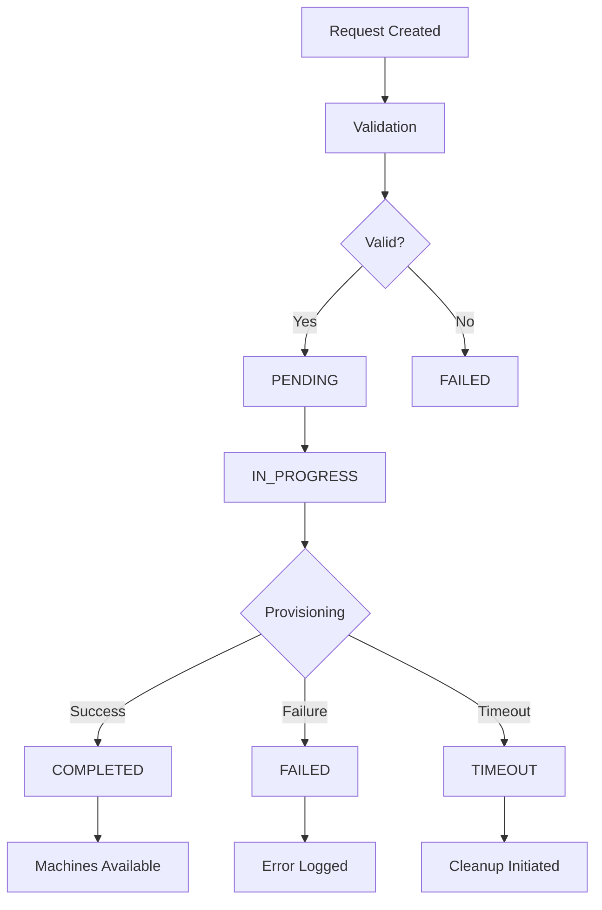

# Request Management

Request management is the core workflow of the Host Factory Plugin, handling the complete lifecycle of machine provisioning and termination requests. This guide covers request creation, monitoring, and management.

## Request Overview

Requests represent the intent to provision or terminate cloud resources. The system supports two primary request types:

- **Provision Requests**: Create new machine instances
- **Return Requests**: Terminate existing machine instances

Each request follows a well-defined lifecycle with status tracking, error handling, and comprehensive audit trails.

## Request Lifecycle

### Provision Request Flow



### Request States

#### PENDING
- Request has been created and validated
- Waiting for provisioning to begin
- All prerequisites have been checked

#### IN_PROGRESS
- Provisioning has started
- Cloud resources are being created
- Progress can be monitored

#### COMPLETED
- All requested machines have been provisioned
- Machines are running and available
- Request is successfully finished

#### FAILED
- Provisioning failed due to an error
- Error details are available
- No machines were created or partial cleanup occurred

#### TIMEOUT
- Request exceeded the specified timeout
- Automatic cleanup may be initiated
- Partial resources may need manual cleanup

#### CANCELLED
- Request was manually cancelled
- Cleanup of any partial resources initiated
- No further processing will occur

## Creating Requests

### Basic Provision Request

```python
# Using the API
request_data = {
    "method": "requestMachines",
    "params": {
        "templateId": "standard-compute",
        "machineCount": 3,
        "timeout": 600
    }
}

response = api_client.call(request_data)
request_id = response["result"]["requestId"]
```

### Advanced Provision Request

```python
# With additional parameters
request_data = {
    "method": "requestMachines",
    "params": {
        "templateId": "high-performance",
        "machineCount": 5,
        "requestId": "custom-req-12345",  # Optional custom ID
        "timeout": 1200,  # 20 minutes
        "tags": {
            "project": "data-processing",
            "environment": "production",
            "owner": "team-alpha",
            "cost-center": "engineering"
        },
        "metadata": {
            "jobId": "job-789",
            "priority": "high",
            "requester": "user@company.com"
        }
    }
}
```

### Return Request

```python
# Request machine termination
return_request = {
    "method": "requestReturnMachines",
    "params": {
        "machineIds": [
            "i-1234567890abcdef0",
            "i-0987654321fedcba0",
            "i-abcdef1234567890"
        ],
        "requestId": "return-req-12345",
        "force": false  # Graceful shutdown
    }
}
```

## Request Monitoring

### Checking Request Status

```python
# Get detailed request status
status_request = {
    "method": "getRequestStatus",
    "params": {
        "requestId": "req-12345"
    }
}

response = api_client.call(status_request)
status = response["result"]

print(f"Status: {status['status']}")
print(f"Progress: {len(status['machines'])}/{status['machineCount']} machines")
```

### Status Response Details

```json
{
  "result": {
    "requestId": "req-12345",
    "status": "COMPLETED",
    "templateId": "standard-compute",
    "machineCount": 3,
    "machines": [
      {
        "machineId": "i-1234567890abcdef0",
        "status": "running",
        "privateIpAddress": "10.0.1.100",
        "publicIpAddress": "54.123.45.67",
        "instanceType": "t3.medium",
        "availabilityZone": "us-east-1a",
        "launchTime": "2025-06-30T12:02:00Z"
      }
    ],
    "createdAt": "2025-06-30T12:00:00Z",
    "updatedAt": "2025-06-30T12:03:00Z",
    "completedAt": "2025-06-30T12:03:00Z",
    "errorMessage": null,
    "tags": {
      "project": "data-processing",
      "environment": "production"
    },
    "metadata": {
      "jobId": "job-789",
      "priority": "high"
    }
  }
}
```

### Monitoring Return Requests

```python
# Check return request status
return_status = {
    "method": "getReturnRequests",
    "params": {
        "requestId": "return-req-12345"
    }
}

response = api_client.call(return_status)
```

## Request Parameters

### Required Parameters

#### For Provision Requests
- **`templateId`**: Template to use for provisioning
- **`machineCount`**: Number of machines to request (1-100)

#### For Return Requests
- **`machineIds`**: List of machine IDs to terminate

### Optional Parameters

#### Common Parameters
- **`requestId`**: Custom request identifier (auto-generated if not provided)
- **`timeout`**: Request timeout in seconds (60-3600, default: 600)
- **`tags`**: Key-value tags for resources
- **`metadata`**: Additional request metadata

#### Provision-Specific Parameters
- **`priority`**: Request priority (low, normal, high)
- **`placement`**: Placement preferences (availability zones, regions)
- **`networking`**: Network configuration overrides

#### Return-Specific Parameters
- **`force`**: Force termination without graceful shutdown
- **`drainTimeout`**: Time to wait for graceful shutdown (seconds)

## Request Validation

### Template Validation

Before creating a request, the system validates:

```python
# Template existence and accessibility
template = get_template(template_id)
if not template:
    raise TemplateNotFoundError(template_id)

# Template capacity limits
if machine_count > template.max_count:
    raise InsufficientCapacityError(
        f"Requested {machine_count}, maximum {template.max_count}"
    )

# Provider compatibility
if not template.is_compatible_with(provider):
    raise ProviderCompatibilityError(template_id, provider.type)
```

### Resource Validation

```python
# Account limits and quotas
current_usage = get_current_resource_usage()
if current_usage + machine_count > account_limit:
    raise QuotaExceededError("Account resource limit exceeded")

# Regional capacity
regional_capacity = get_regional_capacity(region, instance_type)
if regional_capacity < machine_count:
    raise InsufficientCapacityError("Insufficient regional capacity")
```

### Request Parameter Validation

```python
# Machine count validation
if machine_count <= 0:
    raise ValidationError("Machine count must be positive")
if machine_count > 100:
    raise ValidationError("Machine count cannot exceed 100")

# Timeout validation
if timeout < 60:
    raise ValidationError("Timeout must be at least 60 seconds")
if timeout > 3600:
    raise ValidationError("Timeout cannot exceed 3600 seconds")

# Tag validation
for key, value in tags.items():
    if len(key) > 128:
        raise ValidationError(f"Tag key '{key}' exceeds 128 characters")
    if len(value) > 256:
        raise ValidationError(f"Tag value '{value}' exceeds 256 characters")
```

## Request Error Handling

### Common Error Scenarios

#### Template Not Found
```json
{
  "error": {
    "code": "TEMPLATE_NOT_FOUND",
    "message": "Template 'invalid-template' not found",
    "details": {
      "templateId": "invalid-template",
      "availableTemplates": ["standard-compute", "high-memory"]
    }
  }
}
```

#### Insufficient Capacity
```json
{
  "error": {
    "code": "INSUFFICIENT_CAPACITY",
    "message": "Insufficient capacity for requested instance type",
    "details": {
      "requestedCount": 10,
      "availableCapacity": 5,
      "instanceType": "t3.medium",
      "region": "us-east-1"
    }
  }
}
```

#### Quota Exceeded
```json
{
  "error": {
    "code": "QUOTA_EXCEEDED",
    "message": "Account quota would be exceeded",
    "details": {
      "currentUsage": 95,
      "requestedAdditional": 10,
      "accountLimit": 100
    }
  }
}
```

### Error Recovery Strategies

#### Automatic Retry
```python
# Transient errors are automatically retried
RETRYABLE_ERRORS = [
    "INSUFFICIENT_CAPACITY",
    "THROTTLING",
    "SERVICE_UNAVAILABLE"
]

if error_code in RETRYABLE_ERRORS:
    retry_request_with_backoff(request)
```

#### Partial Success Handling
```python
# Handle partial provisioning success
if request.status == "FAILED" and request.partial_machines:
    # Some machines were created before failure
    partial_machines = request.get_partial_machines()

    # Option 1: Keep partial machines
    update_request_status("PARTIAL_SUCCESS")

    # Option 2: Clean up partial machines
    cleanup_partial_machines(partial_machines)
```

## Request Optimization

### Batch Requests

For large-scale provisioning, use batch strategies:

```python
# Instead of one large request
large_request = {
    "templateId": "standard-compute",
    "machineCount": 100  # May fail due to limits
}

# Use multiple smaller requests
batch_size = 20
total_machines = 100
requests = []

for i in range(0, total_machines, batch_size):
    count = min(batch_size, total_machines - i)
    request = {
        "templateId": "standard-compute",
        "machineCount": count,
        "requestId": f"batch-{i//batch_size + 1}",
        "tags": {"batch": str(i//batch_size + 1)}
    }
    requests.append(request)
```

### Request Prioritization

```python
# High priority request
priority_request = {
    "method": "requestMachines",
    "params": {
        "templateId": "standard-compute",
        "machineCount": 5,
        "priority": "high",
        "metadata": {
            "urgency": "critical",
            "sla": "15-minutes"
        }
    }
}
```

### Cost Optimization

```python
# Use spot instances for cost savings
spot_request = {
    "method": "requestMachines",
    "params": {
        "templateId": "cost-optimized-spot",
        "machineCount": 10,
        "tags": {
            "cost-optimization": "spot-instances",
            "fault-tolerance": "high"
        },
        "metadata": {
            "max-spot-price": "0.10",
            "interruption-handling": "graceful"
        }
    }
}
```

## Request Patterns

### Fire-and-Forget Pattern

```python
# Submit request and don't wait
def submit_async_request(template_id, machine_count):
    request = {
        "method": "requestMachines",
        "params": {
            "templateId": template_id,
            "machineCount": machine_count,
            "timeout": 1800  # 30 minutes
        }
    }

    response = api_client.call(request)
    request_id = response["result"]["requestId"]

    # Store request ID for later checking
    store_request_id(request_id)

    return request_id
```

### Synchronous Wait Pattern

```python
# Submit request and wait for completion
def submit_sync_request(template_id, machine_count, max_wait=600):
    # Submit request
    request_id = submit_async_request(template_id, machine_count)

    # Poll for completion
    start_time = time.time()
    while time.time() - start_time < max_wait:
        status = get_request_status(request_id)

        if status["status"] in ["COMPLETED", "FAILED", "TIMEOUT"]:
            return status

        time.sleep(10)  # Poll every 10 seconds

    raise TimeoutError(f"Request {request_id} did not complete within {max_wait} seconds")
```

### Callback Pattern

```python
# Register callback for request completion
def submit_request_with_callback(template_id, machine_count, callback_url):
    request = {
        "method": "requestMachines",
        "params": {
            "templateId": template_id,
            "machineCount": machine_count,
            "metadata": {
                "callback_url": callback_url,
                "callback_events": ["COMPLETED", "FAILED", "TIMEOUT"]
            }
        }
    }

    return api_client.call(request)
```

## Request Monitoring and Alerting

### Real-time Monitoring

```python
# Monitor request progress
def monitor_request(request_id, callback=None):
    while True:
        status = get_request_status(request_id)

        if callback:
            callback(status)

        if status["status"] in ["COMPLETED", "FAILED", "TIMEOUT", "CANCELLED"]:
            break

        time.sleep(30)  # Check every 30 seconds

    return status
```

### Alert Configuration

```python
# Set up alerts for request failures
alert_config = {
    "request_failed": {
        "condition": "status == 'FAILED'",
        "notification": "email",
        "recipients": ["ops-team@company.com"],
        "severity": "high"
    },
    "request_timeout": {
        "condition": "status == 'TIMEOUT'",
        "notification": "slack",
        "channel": "#infrastructure-alerts",
        "severity": "medium"
    },
    "long_running_request": {
        "condition": "duration > 1800",  # 30 minutes
        "notification": "dashboard",
        "severity": "low"
    }
}
```

## Request Analytics

### Request Metrics

Track key metrics for request performance:

- **Success Rate**: Percentage of successful requests
- **Average Duration**: Mean time from request to completion
- **Failure Reasons**: Categorized failure analysis
- **Resource Utilization**: Efficiency of resource allocation
- **Cost per Request**: Financial metrics

### Performance Analysis

```python
# Analyze request performance
def analyze_request_performance(time_period="24h"):
    requests = get_requests_in_period(time_period)

    metrics = {
        "total_requests": len(requests),
        "success_rate": calculate_success_rate(requests),
        "average_duration": calculate_average_duration(requests),
        "failure_breakdown": categorize_failures(requests),
        "peak_hours": identify_peak_usage(requests)
    }

    return metrics
```

## Best Practices

### Request Design
- **Right-size requests**: Balance between too small (overhead) and too large (failure risk)
- **Use appropriate timeouts**: Consider provisioning time and complexity
- **Tag consistently**: Enable cost tracking and resource management
- **Handle failures gracefully**: Implement appropriate error handling and recovery

### Monitoring
- **Monitor request queues**: Track pending request backlogs
- **Set up alerting**: Get notified of failures and long-running requests
- **Track success rates**: Monitor system health and performance
- **Analyze patterns**: Identify optimization opportunities

### Cost Management
- **Use spot instances**: For fault-tolerant workloads
- **Right-size instances**: Match instance types to workload requirements
- **Clean up promptly**: Return unused machines quickly
- **Monitor costs**: Track spending per request and project

## Troubleshooting

### Common Issues

#### Request Stuck in PENDING
```bash
# Check system capacity and queues
hostfactory check-capacity --template-id standard-compute
hostfactory show-queue-status

# Check provider connectivity
hostfactory test-provider --verbose
```

#### High Failure Rate
```bash
# Analyze recent failures
hostfactory analyze-failures --period 24h

# Check provider status
hostfactory provider-status --provider aws

# Validate templates
hostfactory validate-templates
```

#### Slow Request Processing
```bash
# Check system performance
hostfactory performance-report

# Monitor resource usage
hostfactory resource-usage --detailed

# Check provider API latency
hostfactory test-provider-latency
```

## Next Steps

- **[Templates](templates.md)**: Learn about template configuration
- **[API Reference](api_reference.md)**: Complete API documentation
- **[Monitoring](monitoring.md)**: Set up monitoring and alerting
- **[Troubleshooting](troubleshooting.md)**: Common issues and solutions
