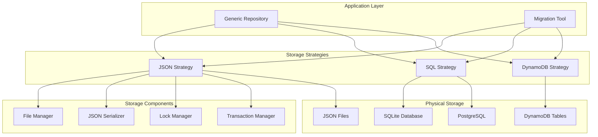

# Storage Strategies

The Open Host Factory Plugin implements a sophisticated storage architecture with multiple strategies, generic repository patterns, and built-in migration capabilities. This guide covers all storage options and their advanced features.

## Overview

The storage system is built on scalable and robust patterns:

- **3 Complete Storage Strategies**: JSON, SQL, DynamoDB
- **Generic Repository Pattern**: Same interface across all storage types
- **Built-in Migration System**: Seamless migration between storage strategies
- **Transaction Management**: ACID compliance with rollback capabilities
- **Concurrency Control**: Optimistic locking and conflict resolution
- **Storage Components**: Modular architecture with pluggable components

## Storage Strategy Architecture



## JSON Storage Strategy

### Single File Storage

The default JSON storage uses a single file containing all entities:

#### Configuration
```json
{
  "storage": {
    "strategy": "json",
    "json_strategy": {
      "storage_type": "single_file",
      "base_path": "data",
      "filenames": {
        "single_file": "request_database.json"
      }
    }
  }
}
```

#### File Structure
```json
{
  "templates": {
    "template-1": {
      "template_id": "template-1",
      "name": "Standard Template",
      "provider_api": "RunInstances",
      "vm_type": "t3.medium",
      "max_number": 10
    }
  },
  "requests": {
    "req-123": {
      "request_id": "req-123",
      "template_id": "template-1",
      "machine_count": 3,
      "status": "COMPLETED"
    }
  },
  "machines": {
    "machine-456": {
      "machine_id": "machine-456",
      "request_id": "req-123",
      "status": "RUNNING",
      "private_ip": "10.0.1.100"
    }
  }
}
```

### Multi-File Storage (Split Files)

For better organization and performance, entities can be split across multiple files:

#### Configuration
```json
{
  "storage": {
    "strategy": "json",
    "json_strategy": {
      "storage_type": "split_files",
      "base_path": "data",
      "filenames": {
        "split_files": {
          "templates": "templates.json",
          "requests": "requests.json",
          "machines": "machines.json"
        }
      }
    }
  }
}
```

#### File Structure
```
data/
+--- templates.json    # Template definitions
+--- requests.json     # Request records
+--- machines.json     # Machine instances
```

#### Individual File Content
**templates.json:**
```json
{
  "template-1": {
    "template_id": "template-1",
    "name": "Standard Template",
    "provider_api": "ec2",
    "vm_type": "t3.medium"
  }
}
```

**requests.json:**
```json
{
  "req-123": {
    "request_id": "req-123",
    "template_id": "template-1",
    "machine_count": 3,
    "status": "COMPLETED"
  }
}
```

### JSON Storage Features

#### Atomic Operations
```python
# JSON storage provides atomic file operations
# Each write operation is atomic at the file level
from src.infrastructure.persistence.json.strategy import JSONStorageStrategy

json_storage = JSONStorageStrategy(config)
# Atomic operations are handled internally
json_storage.save_entity("requests", request_data)
# File is written atomically with backup creation
```

#### Concurrent Access Control
```python
# Optimistic locking prevents conflicts
try:
    storage.update_entity("req-123", updated_data, expected_version=5)
except ConcurrencyConflictError:
    # Handle version conflict
    current_data = storage.get_entity("req-123")
    # Merge changes and retry
```

#### Transaction Management
```python
# Transaction support with rollback
with storage.begin_transaction() as tx:
    tx.save_entity("requests", request_data)
    tx.save_entity("machines", machine_data)
    # Automatically commits or rolls back
```

## SQL Storage Strategy

### SQLite Configuration

For local development and small deployments:

```json
{
  "storage": {
    "strategy": "sql",
    "sql_strategy": {
      "type": "sqlite",
      "name": "request_database.db",
      "host": "",
      "port": 0,
      "pool_size": 5,
      "max_overflow": 10,
      "timeout": 30
    }
  }
}
```

### PostgreSQL Configuration

For production deployments:

```json
{
  "storage": {
    "strategy": "sql",
    "sql_strategy": {
      "type": "postgresql",
      "host": "localhost",
      "port": 5432,
      "name": "hostfactory",
      "username": "hostfactory_user",
      "password": "${DB_PASSWORD}",
      "pool_size": 20,
      "max_overflow": 30,
      "timeout": 60
    }
  }
}
```

### Database Schema

The SQL strategy automatically creates these tables:

#### Templates Table
```sql
CREATE TABLE templates (
    template_id VARCHAR(255) PRIMARY KEY,
    name VARCHAR(255) NOT NULL,
    provider_api VARCHAR(50) NOT NULL,
    vm_type VARCHAR(50) NOT NULL,
    max_number INTEGER NOT NULL,
    image_id VARCHAR(255),
    subnet_ids TEXT,
    security_group_ids TEXT,
    attributes TEXT,
    created_at TIMESTAMP DEFAULT CURRENT_TIMESTAMP,
    updated_at TIMESTAMP DEFAULT CURRENT_TIMESTAMP
);
```

#### Requests Table
```sql
CREATE TABLE requests (
    request_id VARCHAR(255) PRIMARY KEY,
    template_id VARCHAR(255) NOT NULL,
    machine_count INTEGER NOT NULL,
    status VARCHAR(50) NOT NULL,
    request_type VARCHAR(50) NOT NULL,
    created_at TIMESTAMP DEFAULT CURRENT_TIMESTAMP,
    updated_at TIMESTAMP DEFAULT CURRENT_TIMESTAMP,
    completed_at TIMESTAMP,
    tags TEXT,
    metadata TEXT,
    FOREIGN KEY (template_id) REFERENCES templates(template_id)
);
```

#### Machines Table
```sql
CREATE TABLE machines (
    machine_id VARCHAR(255) PRIMARY KEY,
    request_id VARCHAR(255) NOT NULL,
    template_id VARCHAR(255) NOT NULL,
    status VARCHAR(50) NOT NULL,
    instance_type VARCHAR(50),
    provider_instance_id VARCHAR(255),
    private_ip VARCHAR(45),
    public_ip VARCHAR(45),
    created_at TIMESTAMP DEFAULT CURRENT_TIMESTAMP,
    started_at TIMESTAMP,
    terminated_at TIMESTAMP,
    FOREIGN KEY (request_id) REFERENCES requests(request_id),
    FOREIGN KEY (template_id) REFERENCES templates(template_id)
);
```

### SQL Storage Features

#### Connection Pooling
```python
# Automatic connection pool management
sql_strategy = SQLStorageStrategy(config)
# Pool size: 20 connections
# Max overflow: 30 additional connections
# Automatic connection recycling
```

#### Query Optimization
```python
# Optimized queries with indexes
requests = storage.query_entities(
    "requests",
    filters={"status": "PENDING"},
    order_by="created_at",
    limit=50
)
```

#### Transaction Support
```python
# Transaction support varies by storage strategy
# JSON: File-level atomic operations
# SQL: Full ACID transaction support  
# DynamoDB: Limited transaction support

# SQL storage transaction example
from src.infrastructure.persistence.sql.strategy import SQLStorageStrategy

sql_storage = SQLStorageStrategy(config)
# SQL transactions are handled internally by the storage strategy
# when performing batch operations
```

## DynamoDB Storage Strategy

### Configuration

For AWS cloud deployments:

```json
{
  "storage": {
    "strategy": "dynamodb",
    "dynamodb_strategy": {
      "region": "us-east-1",
      "profile": "production",
      "table_prefix": "hostfactory",
      "read_capacity": 5,
      "write_capacity": 5,
      "billing_mode": "PAY_PER_REQUEST"
    }
  }
}
```

### Table Structure

DynamoDB strategy creates these tables:

#### Templates Table
- **Table Name**: `hostfactory_templates`
- **Partition Key**: `template_id` (String)
- **Attributes**: All template fields as DynamoDB attributes

#### Requests Table
- **Table Name**: `hostfactory_requests`
- **Partition Key**: `request_id` (String)
- **Global Secondary Index**: `template_id-created_at-index`
- **Attributes**: All request fields with appropriate typing

#### Machines Table
- **Table Name**: `hostfactory_machines`
- **Partition Key**: `machine_id` (String)
- **Global Secondary Index**: `request_id-created_at-index`
- **Attributes**: All machine fields with DynamoDB types

### DynamoDB Features

#### Auto-Scaling
```json
{
  "dynamodb_strategy": {
    "auto_scaling": {
      "enabled": true,
      "min_read_capacity": 1,
      "max_read_capacity": 100,
      "min_write_capacity": 1,
      "max_write_capacity": 100,
      "target_utilization": 70
    }
  }
}
```

#### Global Secondary Indexes
```python
# Query by template_id
requests = storage.query_by_gsi(
    "requests",
    index_name="template_id-created_at-index",
    key_condition="template_id = :template_id",
    expression_values={":template_id": "template-1"}
)
```

#### Conditional Updates
```python
# Prevent concurrent modifications
storage.update_entity(
    "requests",
    request_id,
    updated_data,
    condition_expression="attribute_exists(request_id) AND version = :expected_version",
    expression_values={":expected_version": current_version}
)
```

## Generic Repository Pattern

### Repository Interface

All storage strategies implement the same interface:

```python
class RepositoryInterface:
    """Generic repository interface for all storage strategies."""

    def save_entity(self, collection: str, entity_data: Dict[str, Any]) -> None:
        """Save an entity to storage."""
        pass

    def get_entity(self, collection: str, entity_id: str) -> Optional[Dict[str, Any]]:
        """Retrieve an entity by ID."""
        pass

    def update_entity(self, collection: str, entity_id: str, 
                     entity_data: Dict[str, Any]) -> None:
        """Update an existing entity."""
        pass

    def delete_entity(self, collection: str, entity_id: str) -> None:
        """Delete an entity."""
        pass

    def query_entities(self, collection: str, 
                      filters: Dict[str, Any] = None,
                      order_by: str = None,
                      limit: int = None) -> List[Dict[str, Any]]:
        """Query entities with filters."""
        pass
```

### Usage Example

The same code works with any storage strategy:

```python
# Works with JSON, SQL, or DynamoDB
def create_request(repository: RepositoryInterface, request_data: Dict[str, Any]) -> str:
    """Create a request using any storage strategy."""

    # Validate template exists
    template = repository.get_entity("templates", request_data["template_id"])
    if not template:
        raise TemplateNotFoundError("Template not found")

    # Save request
    repository.save_entity("requests", request_data)

    # Create machines
    for i in range(request_data["machine_count"]):
        machine_data = {
            "machine_id": f"machine-{uuid.uuid4()}",
            "request_id": request_data["request_id"],
            "template_id": request_data["template_id"],
            "status": "PENDING"
        }
        repository.save_entity("machines", machine_data)

    return request_data["request_id"]
```

## Repository Migration System

### Migration Command

Built-in migration between storage strategies:

```bash
# Migrate from JSON to SQL
python run.py migrateRepository \
  --source-type json \
  --target-type sql \
  --batch-size 100

# Migrate from SQL to DynamoDB
python run.py migrateRepository \
  --source-type sql \
  --target-type dynamodb \
  --batch-size 50
```

### Migration Process

#### 1. Pre-Migration Validation
```python
# Validate source and target configurations
migration_tool.validate_source_connection()
migration_tool.validate_target_connection()
migration_tool.validate_schema_compatibility()
```

#### 2. Backup Creation
```python
# Automatic backup before migration
backup_path = migration_tool.create_backup(
    source_type="json",
    backup_location="backups/migration_backup_20250630.json"
)
```

#### 3. Batch Migration
```python
# Migrate in configurable batches
for batch in migration_tool.get_migration_batches(batch_size=100):
    # Migrate templates
    templates = source_repo.query_entities("templates", limit=batch_size)
    for template in templates:
        target_repo.save_entity("templates", template)

    # Migrate requests
    requests = source_repo.query_entities("requests", limit=batch_size)
    for request in requests:
        target_repo.save_entity("requests", request)

    # Migrate machines
    machines = source_repo.query_entities("machines", limit=batch_size)
    for machine in machines:
        target_repo.save_entity("machines", machine)
```

#### 4. Data Validation
```python
# Verify migration completeness
migration_stats = migration_tool.validate_migration()
print(f"Migrated {migration_stats['templates']} templates")
print(f"Migrated {migration_stats['requests']} requests")
print(f"Migrated {migration_stats['machines']} machines")
```

### Migration Configuration

```json
{
  "migration": {
    "batch_size": 100,
    "create_backup": true,
    "backup_location": "backups/",
    "validate_after_migration": true,
    "cleanup_source": false,
    "parallel_workers": 4
  }
}
```

## Transaction Management

### Transaction Support by Strategy

| Feature | JSON | SQLite | PostgreSQL | DynamoDB |
|---------|------|--------|------------|----------|
| ACID Transactions | [[]] | [[]] | [[]] | [!] Limited |
| Rollback Support | [[]] | [[]] | [[]] | [!] Limited |
| Isolation Levels | Basic | Full | Full | Eventual |
| Concurrent Access | File Lock | DB Lock | DB Lock | Optimistic |

### Transaction Usage

#### JSON Strategy
```python
with json_storage.begin_transaction() as tx:
    tx.save_entity("requests", request_data)
    tx.save_entity("machines", machine_data)
    # File is locked during transaction
    # Automatic rollback on exception
```

#### SQL Strategy
```python
with sql_storage.begin_transaction() as tx:
    tx.save_entity("requests", request_data)
    tx.update_entity("templates", template_id, updated_template)
    # Full ACID compliance
    # Automatic commit/rollback
```

#### DynamoDB Strategy
```python
# DynamoDB transactions (limited to 25 items)
with dynamodb_storage.begin_transaction() as tx:
    tx.save_entity("requests", request_data)
    tx.conditional_update("machines", machine_id, machine_data)
    # Conditional operations for consistency
```

## Concurrency Control

### Optimistic Locking

All strategies support optimistic locking:

```python
# Version-based concurrency control
try:
    storage.update_entity(
        "requests", 
        request_id, 
        updated_data, 
        expected_version=current_version
    )
except ConcurrencyConflictError as e:
    # Handle version conflict
    latest_data = storage.get_entity("requests", request_id)
    merged_data = merge_changes(latest_data, updated_data)
    storage.update_entity("requests", request_id, merged_data)
```

### Lock Management

#### File-Based Locking (JSON)
```python
# Reader-writer locks for JSON files
with storage.acquire_read_lock():
    data = storage.read_file()

with storage.acquire_write_lock():
    storage.write_file(data)
```

#### Database Locking (SQL)
```python
# Database-level locking
storage.execute_with_lock(
    "SELECT * FROM requests WHERE id = ? FOR UPDATE",
    [request_id]
)
```

## Performance Considerations

### Storage Strategy Performance

| Aspect | JSON | SQLite | PostgreSQL | DynamoDB |
|--------|------|--------|------------|----------|
| Read Performance | Good | Good | Excellent | Excellent |
| Write Performance | Good | Good | Excellent | Excellent |
| Concurrent Access | Limited | Good | Excellent | Excellent |
| Scalability | Limited | Medium | High | Very High |
| Setup Complexity | Low | Low | Medium | Medium |

### Optimization Strategies

#### JSON Storage
```json
{
  "json_strategy": {
    "enable_compression": true,
    "cache_size": 1000,
    "write_buffer_size": 64000,
    "sync_writes": false
  }
}
```

#### SQL Storage
```json
{
  "sql_strategy": {
    "pool_size": 20,
    "max_overflow": 30,
    "pool_timeout": 30,
    "pool_recycle": 3600,
    "enable_query_cache": true
  }
}
```

#### DynamoDB Storage
```json
{
  "dynamodb_strategy": {
    "read_capacity": 10,
    "write_capacity": 10,
    "auto_scaling": true,
    "enable_dax": true,
    "consistent_reads": false
  }
}
```

## Best Practices

### Choosing a Storage Strategy

#### Use JSON When:
- Small to medium datasets (< 10,000 records)
- Simple deployment requirements
- Development and testing environments
- Single-instance deployments

#### Use SQLite When:
- Medium datasets (< 100,000 records)
- Need ACID transactions
- Single-instance production deployments
- Local development with SQL features

#### Use PostgreSQL When:
- Large datasets (> 100,000 records)
- High concurrency requirements
- Multi-instance deployments
- Complex queries and reporting

#### Use DynamoDB When:
- Very large datasets (millions of records)
- High availability requirements
- AWS cloud deployments
- Global distribution needs

### Migration Strategy

1. **Start with JSON** for development
2. **Migrate to SQLite** for single-instance production
3. **Migrate to PostgreSQL** for high-concurrency production
4. **Migrate to DynamoDB** for cloud-scale deployments

### Backup Strategy

```bash
# JSON backup
cp data/request_database.json backups/backup_$(date +%Y%m%d).json

# SQL backup
pg_dump hostfactory > backups/backup_$(date +%Y%m%d).sql

# DynamoDB backup
aws dynamodb create-backup --table-name hostfactory_requests --backup-name backup_$(date +%Y%m%d)
```

## Troubleshooting

### Common Issues

#### JSON Storage Issues
```bash
# Check file permissions
ls -la data/request_database.json

# Validate JSON format
python -m json.tool data/request_database.json

# Check disk space
df -h data/
```

#### SQL Storage Issues
```bash
# Test connection
python -c "
from src.infrastructure.persistence.sql.strategy import SQLStorageStrategy
storage = SQLStorageStrategy(config)
storage.test_connection()
"

# Check database size
du -sh request_database.db
```

#### DynamoDB Storage Issues
```bash
# Check table status
aws dynamodb describe-table --table-name hostfactory_requests

# Check capacity utilization
aws dynamodb describe-table --table-name hostfactory_requests | jq '.Table.BillingModeSummary'
```

## Next Steps

- **[Configuration Reference](../configuration/native-spec-config.md)**: Complete configuration options
- **[Migration Procedures](../operational/migration.md)**: Detailed migration procedures
- **[Performance Tuning](../operational/performance.md)**: Optimization strategies
- **[Backup & Recovery](../operational/backup_recovery.md)**: Backup and recovery procedures
